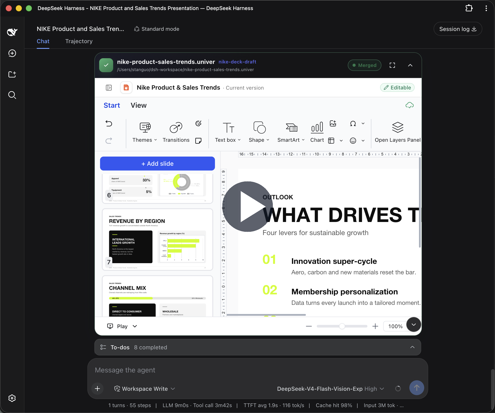
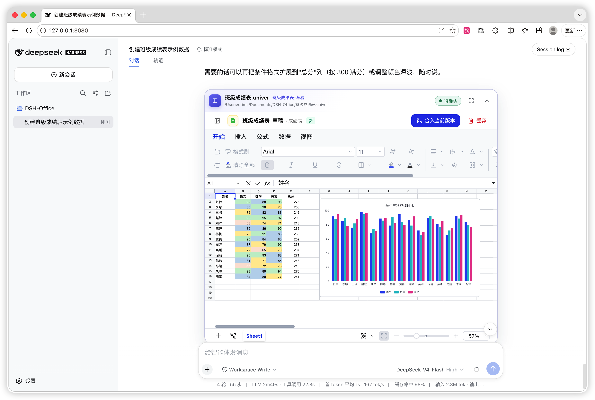
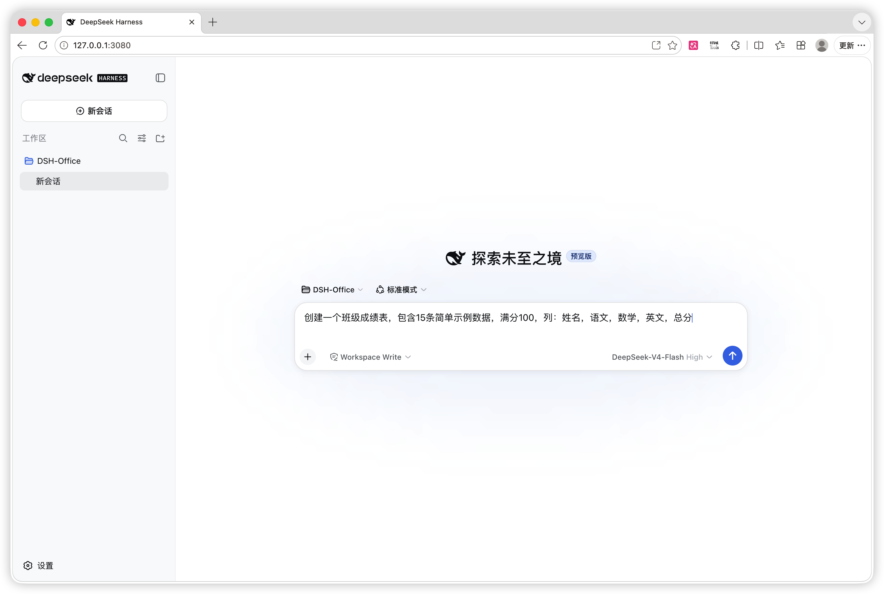
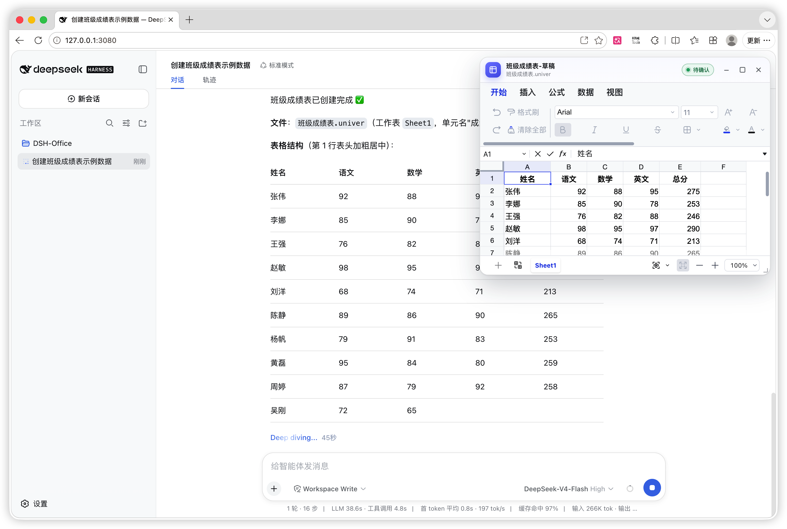
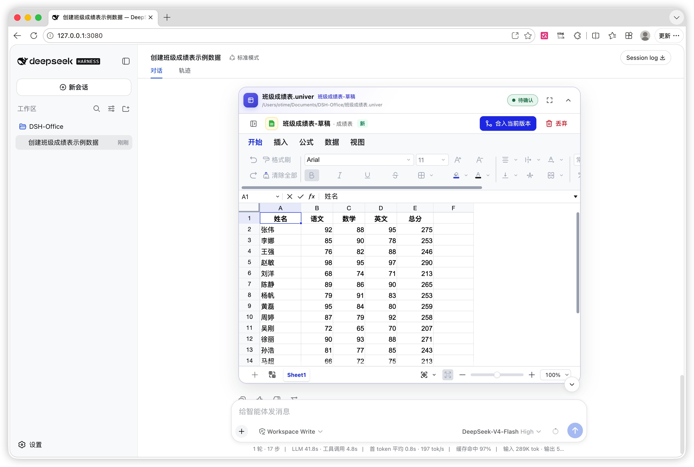
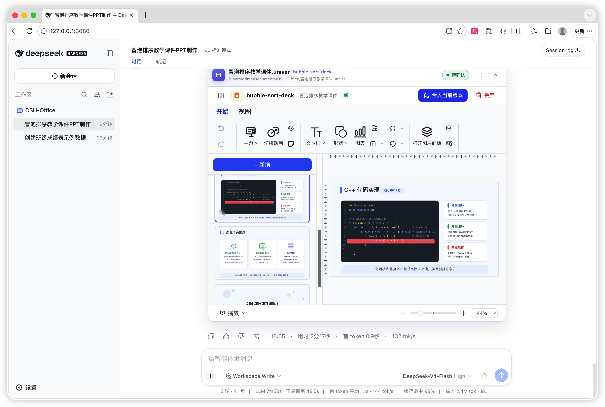
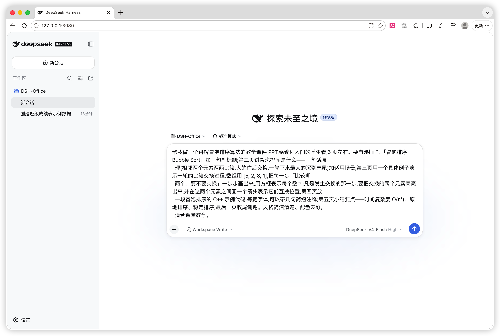
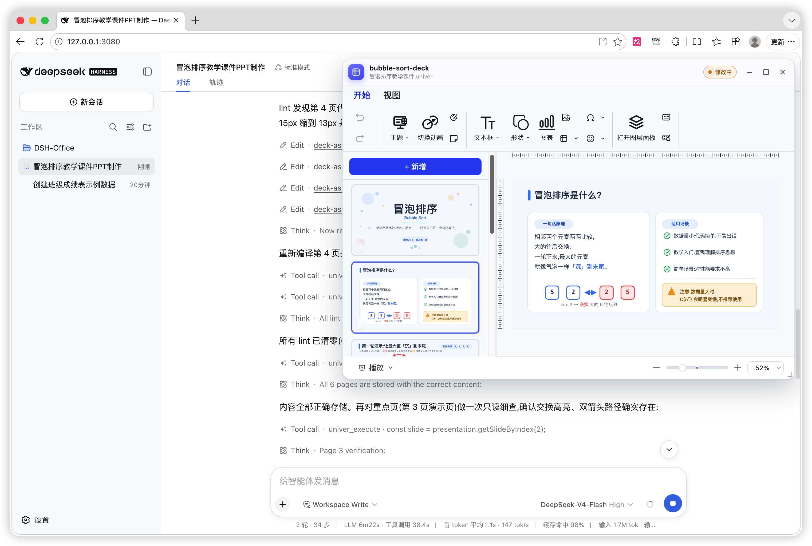

# DSH × Univer Office

> Give DeepSeek Harness a real office environment.
>
> Univer Office Plugin brings spreadsheets, docs, slides, canvases, relational tables, and more into one runtime — with connected data, validation, versioned changes, and isolated worktrees for multi-agent collaboration.

English · [简体中文](README.zh-CN.md)

[Upstream project](https://github.com/dream-num/dsh-univer-office)
[](package.json)
[](LICENSE)

`@e-mate/dsh-plugin-univer-office` adapts the Univer office plugin to e-Mate's fixed DeepSeek Harness (DSH) `0.1.0-rc.7` runtime. Tell the agent what you need and it can create or edit spreadsheets, documents, presentations, multidimensional tables, and canvases, or work with existing Excel, Word, and PowerPoint files. Every change is verified and stays in the conversation for you to preview, approve, or discard.

After installation, describe the result you want in natural language. The agent handles creation, editing, and verification while you follow the work live and review the result in the conversation. Deliver spreadsheets as Excel (`.xlsx`), documents as Word (`.docx`), and presentations as PowerPoint (`.pptx`) files when needed.

## See it in action

[](https://www.youtube.com/watch?v=k-2zW_CMiew)


The agent created this spreadsheet from a natural-language request, then added conditional formatting and a chart in the same conversation. The result can be previewed, revised, merged into the current version, or discarded in place.



> **Deliver a standard Excel file:** after review, ask the agent to export the spreadsheet as `.xlsx` so it can be opened and edited in Excel, WPS Office, and other compatible office applications.

<details>
<summary>See the complete workflow from request to review</summary>

### 1. Describe the task in natural language



### 2. Follow the result live while the agent works



### 3. Approve or discard the changes in the conversation



</details>

### Generate a presentation from one request

Give the agent a topic, audience, page count, content outline, and visual direction. It can build the complete presentation, verify content and layout page by page, and leave the result in the conversation for review.



> **Deliver a standard PowerPoint file:** after review, ask the agent to export the presentation as `.pptx` so it can be presented and edited in PowerPoint, WPS Office, and other compatible office applications.

<details>
<summary>See the presentation workflow from request to finished deck</summary>

#### 1. Specify the topic, audience, and page requirements



#### 2. Follow and verify the pages while the agent works



</details>

## What can it do?

- **Analyze and build spreadsheets** — read or create Excel data, clean fields, write formulas, apply formatting and validation, create tables, charts, pivots, filters, sparklines, conditional formatting, and images, then export the result as `.xlsx`, `.csv`, or `.tsv`.
- **Write and lay out documents** — create paragraphs, rich text, lists, tasks, tables, images, charts, headers, footers, pagination, and page layouts.
- **Create and revise presentations** — generate a deck from an outline, redesign selected pages, edit text, shapes, images, tables, charts, and transitions, then detect off-page, overflowing, and overlapping text.
- **Build lightweight databases** — create Base tables, fields, records, and views with formula fields, filters, sorting, grouping, and Sheet-backed references.
- **Draw editable canvases** — create shapes, text, connectors, images, native charts, and diagrams, with connector and layout analysis.
- **Compose several content types** — one `.univer` file can contain Sheets, Docs, Slides, Bases, and Boards. Formulas and embedded content can reference other content in the same file.
- **Work with Office files** — import `.xlsx`, `.csv`, `.tsv`, `.docx`, and `.pptx`, then export the edited content in the matching format.
- **Review agent changes safely** — every write starts in an isolated draft. Watch changes live, then approve or discard them instead of letting the agent overwrite the current version.
- **Compare worktree changes semantically** — switch a draft or submitted worktree from View to Compare to inspect Sheet, Doc, Slide, Base, or Board changes side by side against a pinned trunk version or another active worktree.

### Example requests

```text
Create a simple payroll spreadsheet with employee, base salary, bonus, deduction, gross pay, and net pay columns. Calculate the totals automatically.

Create a six-slide lesson deck about bubble sort. Explain the concept, each comparison pass, pseudocode, and complexity, and check every page for layout problems.

Create a formal weekly project report with an executive summary, this week's progress, a risk table, next week's plan, headers, and footers, then export it as docx.

Create a customer-tracking Base with company, contact, stage, expected value, and next action fields, plus a view grouped by stage.

Create a sales Sheet and a summary Slide in the same .univer file, with the Slide chart reading the Sheet data.
```

## Capabilities

| Content | Create and edit | Verify and review | Import | Export |
| --- | --- | --- | --- | --- |
| Sheet | Cells, formulas, styles, tables, charts, pivots, filters, validation, images, and more | Structured range inspection, recalculation, screenshots, PDF printing, live preview | `.xlsx` `.csv` `.tsv` | `.xlsx` `.csv` `.tsv` |
| Doc | Paragraphs, rich text, lists, tasks, tables, images, charts, headers, footers, pagination | Document readback, page screenshots, PDF printing, live preview | `.docx` | `.docx` |
| Slide | Pages, text, shapes, images, tables, charts, SVG layouts, transitions | Structure inspection, layout lint, screenshots, PDF printing, live preview | `.pptx` | `.pptx` |
| Base | Tables, fields, records, views, formulas, filters, sorting, grouping | Structured data checks, workbench screenshot, live preview | — | `.xlsx` `.csv` `.tsv` |
| Board | Shapes, text, connectors, images, native charts, routing | Element analysis, screenshots, PDF printing, live preview | — | — |

Every content type supports isolated draft editing, side-by-side semantic comparison, review, revision, approval, and discarding. Base and Board support structural verification; Board file export is not yet supported.

## Get started in 3 minutes

### 1. Install the e-Mate plugin when needed

This plugin is distributed separately from the e-Mate application. Install the reviewed `@e-mate/dsh-plugin-univer-office@2.0.18` TGZ through e-Mate's native plugin installation flow. The host package manager installs its runtime dependencies for your operating system and architecture; network and registry access are required. The upstream `dsh-univer-office@0.2.14` package is not this rc.7 adaptation. Public catalog availability and installation acceptance are separate from building a local archive.

### 2. Describe what you need

```text
Create a monthly expense spreadsheet with dates, categories, amounts, a total, and a few rows of sample data.
```

### 3. Review it in the conversation

- Changes appear in a live, movable preview window while the agent works.
- Review cards remain in the conversation and can be folded or opened fullscreen later.
- Continue editing, approve, or discard changes from the Univer page embedded in the card.

## How it works

1. Describe the result you want and provide any source files.
2. The agent creates an isolated draft and edits the Univer content there.
3. Follow the live preview and ask for revisions until the result is ready.
4. Approve the result to update the current version, or discard the draft without changing it.

Approval and discarding always require an explicit user request.

## Built-in tools

DSH selects these tools automatically; you normally do not need to call them manually.

| Tool | Purpose |
| --- | --- |
| `univer_new` | Create an empty `.univer` file without overwriting an existing file |
| `univer_status` | View the content and draft status of a file |
| `univer_worktree` | Create, submit, revise, approve, or discard an isolated draft |
| `univer_unit` | Add or remove Sheet, Doc, Slide, Base, or Board content |
| `univer_import` | Import an Office file into a `.univer` file |
| `univer_inspect` | Read document structure or a selected Sheet range |
| `univer_execute` | Read or edit content through the Univer API |
| `univer_export` | Export Sheet, Doc, Slide, or Base content |
| `univer_lint` | Find off-page, overflowing, and overlapping Slide text |
| `univer_compile_svg` | Add an SVG layout to a Slide with measured text |
| `univer_screenshot` | Render supported content as PNG images for review |
| `univer_print_pdf` | Print a Sheet, Doc, Slide, or Board to a workspace PDF file |
| `univer_api` | Find bundled Univer API symbols by keyword and show exact references |
| `univer_resources` | Find and use bundled icons, logos, emoji, and illustrations |

## Preview and review experience

- **Live Univer window** — changes open automatically in a window you can drag, resize, fold, or maximize. Disable automatic opening under **Settings → Plugins → Plugin configuration → Univer Office** without removing conversation review cards.
- **Conversation review cards** — each edited `.univer` file has its own full preview card, while deleted temporary files leave no stale cards behind.
- **Pinned worktree comparison** — use **Compare** in a draft or submitted worktree to compare it with trunk or another active worktree. Both sides are pinned when the comparison opens, changed entities can be navigated, and a refresh control appears if either side advances.
- **Responsive review Header** — View/Compare stays centered when space permits; controls share a compact row and wrap in order as the window narrows. The title shows the selected document name; long names truncate, and merge-status messages remain visible.
- **Historical review** — drafts, submitted changes, approvals, and discarded results remain in the conversation, with older cards collapsed by default.
- **Session isolation** — each DSH session shows only its own windows, cards, and review state.
- **English and Chinese UI** — the plugin shell and every open Viewer follow the DSH locale.
- **Import, export, and print** — the current version can import Office files, export supported content, and print from the Univer Ribbon. Draft and review previews do not allow import or export; Board provides print only.
- **Version history for all five Unit types** — current Sheet, Doc, Slide, Base, and Board views show time-grouped history. Read-only views can inspect versions, while editable views can restore one explicitly.

## Requirements and current limits

- The e-Mate Harness `0.1.0-rc.7` runtime and Node.js `>=22.19.0`.
- Runtime dependencies are installed on the user host. The TGZ contains application code, assets, and Skills, without a preinstalled `node_modules` tree or native libraries.
- The pinned formula and document-conversion native libraries provide macOS ARM64 and Windows x64 builds, but no macOS Intel build. Full Intel Office support remains unavailable with this dependency version.
- PDF printing is supported; this component does not provide arbitrary editing of existing PDF files.
- Some Slide layout checks and SVG text measurement require a local Chrome/Chromium executable. Set `UNIVER_RENDER_BROWSER` to use a specific browser path.
- Slide master pages, layout pages, and speaker notes are outside the current editing scope.
- Board mind maps, tables, ink, advanced editing, and file export are not yet supported.

## Configuration

The defaults are designed for local use: the service starts at port `9080`. If that port is occupied, it tries `9081`, then continues upward one port at a time. Set these plugin options when you need different values:

| Field | Default | Purpose |
| --- | --- | --- |
| `gatewayPort` | `9080` | Initial loopback service port; occupied ports advance by one |
| `autoStartGateway` | `true` | Start the service on first use |
| `gatewayStartupTimeoutMs` | `10000` | Service startup timeout |
| `gatewayRequestTimeoutMs` | `3000` | State-read timeout |
| `gatewayMutationTimeoutMs` | `60000` | Write-operation timeout |
| `unitContentOperationTimeoutMs` | `120000` | Import, export, inspection, and execution timeout |
| `screenshotOperationTimeoutMs` | `120000` | Overall timeout for one browser screenshot operation |
| `printPdfOperationTimeoutMs` | `120000` | Overall timeout for one browser PDF print operation |
| `screenshotMaxPages` | `30` | Maximum Doc or Slide pages rendered by one screenshot call |
| `screenshotMaxPixels` | `16777216` | Maximum pixel count for each screenshot image |
| `resourceCacheRoot` | `$DSH_HOME/cache/dsh-univer-office/resources` | Persistent downloaded-SVG cache; falls back to `~/.dsh` when `DSH_HOME` is unset |
| `resourceDownloadTimeoutMs` | `15000` | Timeout for one SVG resource download |
| `resourceOperationTimeoutMs` | `120000` | Overall timeout for one resource-library tool operation |
| `tools` | `true` | Enable agent editing capabilities |
| `skills` | `true` | Enable bundled task guidance |
| `telemetry` | `false` | Send anonymous product telemetry |

## Telemetry

Telemetry is disabled by default in e-Mate. The package declares no install or uninstall telemetry hook. Explicitly enabling `telemetry: true` permits the upstream allowlisted anonymous Host events, which exclude file contents and paths; `DO_NOT_TRACK=1` disables them.

## Updates and removal

Use e-Mate's native plugin management flow to update or remove this separately installed plugin. An e-Mate application update does not itself install or update the plugin.

## Development

This project is a standard [DSH bundle](https://github.com/deepseek-ai/deepseek-harness/blob/main/docs/user/develop/basic/publish.md). Its Host composes the Univer Service Provider, Tools Consumer, webServer Consumer, and Skill Provider. The bundle includes its Gateway, Viewer, headless Unit Content Worker, and Slide render machine. See the [architecture document](docs/architecture.md) for dependency directions and runtime boundaries.

The project requires Node.js `>=22.19.0` and `pnpm@11.7.0`.

```sh
pnpm install
pnpm run lint
pnpm run typecheck
pnpm run build
pnpm run test
```

After the complete test suite passes, `pnpm pack --pack-destination <output-directory>` creates the TGZ from the manifest's file allowlist. `bash scripts/build-dist.sh [output-directory]` rebuilds all applications and runs the same pack command. Neither command publishes or installs the package.

## Package identity

This adaptation is `@e-mate/dsh-plugin-univer-office@2.0.18`, based on upstream `dsh-univer-office@0.2.14`. Keep the package name, version, and reviewed archive hash together when installing it. A locally built TGZ does not establish npm publication or compatibility of an upstream package with e-Mate.

## License

[Apache-2.0](LICENSE) covers the upstream plugin source. Univer Pro dependencies retain their own authorization and licensing terms; this license does not relicense those packages. See [SOURCE.md](SOURCE.md).
