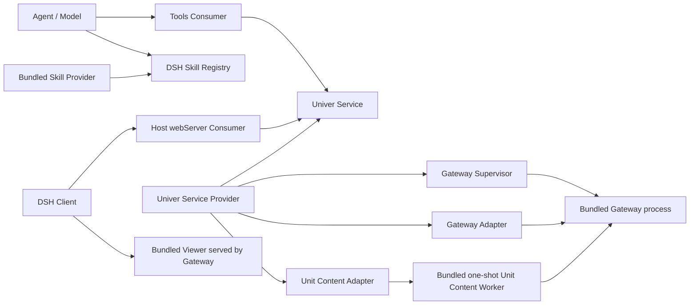

# DSH × Univer 插件架构

状态：已接受
日期：2026-08-17

本文档是本插件实现与重构的架构依据。原型代码只用于验证产品需求，不构成兼容性约束；重构可以删除、改名或重写任意原型实现，但必须保留本文列出的用户功能。

## 1. 决策摘要

本插件采用单 npm 包、多个 Cordis 插件角色的结构：

- `service` 定义稳定的 Univer 领域接口；
- `provider` 实现该接口并拥有状态缓存、文件操作和 worktree 操作；
- `webServer` 把需要浏览器访问的服务能力映射为 Host HTTP API；
- `settings` 在 DSH Settings 可用时注册浏览器展示偏好；
- `tools` 把适合模型调用的内容创作能力映射为 DSH 工具；
- `skills` 向 DSH Skill Registry 提供按需加载的 Univer 工作流与 Unit 专项知识；
- `processes/gateway` 负责插件内置 Gateway 进程和 Viewer 资源；
- `workers/unit-content` 是一次性 Unit Content Worker 的子进程入口；
- `client` 负责 DSH 浏览器端的预览、实时 worktree 窗口和用户审阅界面；
- `shared/wire` 只存放 Host 与 Client 共享的纯 JSON 数据类型；
- `telemetry` 提供 best-effort 的匿名产品遥测，只在 Host 与包卸载入口发送，发布包不声明 `postinstall`，任何失败都不影响启动与卸载。

用户只安装本插件即可使用全部功能。全局 `univer` CLI 不属于运行依赖；Unit 的导入、检查、执行和导出由插件内置的一次性 Unit Content Worker 完成。

代码、API 和界面使用具体名称 `Gateway`、`Viewer`、`Unit Content Worker` 和 `artifacts`，不使用含义宽泛的 `runtime` 或 `daemon` 作为本插件领域名称。

## 2. 必须保留的产品功能

- 在 DSH 会话中发现 `.univer` 文件，并为每个文件显示采用统一审阅布局的回合尾部卡片；
- 在 DSH 内以 Viewer 全屏预览文件；
- worktree 创建或更新后显示实时浮动窗口；
- 用户可在 DSH 插件设置中关闭实时浮动窗口，且不影响回合尾部审阅卡片；
- 一个 worktree 改动多个 unit 时，只列出有改动的 unit 并允许切换；
- draft 或 ready worktree 的 Viewer 可在 View 与 Compare 间切换，把当前 worktree 与固定的 trunk 或另一个活跃 worktree 并排比较，并为 Sheet、Doc、Slide、Base 与 Board 提供语义差异列表、定位和显式刷新；
- 会话结束后在最近一次操作各 worktree 的回合末尾为 `draft` 或 `ready` worktree 显示嵌入式审阅面板；
- 后续回合再次操作同一 worktree 时，旧回合保留同一张完整卡片并默认折叠，不回退到旧文件预览卡片或单独历史 header；
- 审阅卡片使用紧凑 header：首行显示 Univer 文件名和右侧的 worktree 名称，次行只显示完整文件路径，状态、折叠和全屏控制位于右侧；桌面端不同生命周期的展开卡片默认总高度约 650px，内嵌完整页面默认折叠左侧边栏，卡片折叠保留已加载页面；全屏时隐藏折叠按钮，Esc 退出全屏；
- draft、ready 状态的提交确认、丢弃与合入当前版本只使用完整 Univer 页面内置操作，卡片外壳不重复提供 action footer；
- worktree 进入 `merged` 或 `discarded` 终态后不再显示浮窗或修改操作，但保留审阅卡片并在完整页面中显示主线；
- 插件按需启动并管理内置 Gateway 和 Viewer；
- 多个 DSH 会话的预览目标与审阅状态相互隔离；
- 中英文界面；
- Univer 文件尚无 Unit 时，Viewer 使用现有空状态布局并显示“空文件”；
- 模型可创建空 `.univer` 文件、管理 worktree 与 Unit、导入 Office 文件、查询 Univer API、修改、检查和导出内容；
- 模型可对 Slide 执行不输出图片的真实布局检查，并把 workspace 内的 SVG 编译并应用到显式 Slide 页面；
- 模型可从内置多 registry 资源库查找、读取并导出 SVG 资源，下载缓存由 Provider 持久管理；
- 模型可把显式 Unit 渲染为 workspace 内 PNG，并在当前模型支持图片输入时以 DSH attachment 回读；Sheet 支持范围，Doc/Slide 支持页面，Slide 支持联系表，Board 支持区域与元素聚焦；
- `ready` 与 `reopen` 属于模型工作流，`merge` 与 `discard` 只在用户明确要求且 DSH 审批通过后执行；

原型的文件布局、类名、HTTP 路径、CSS 类名、bash 命令解析方式和内部数据格式均不需要保留。

## 3. 进程与模块组成



根插件是组合入口。它必须由 DSH 配置以裸包名加载，使 DSH 能发现包清单中的 `dsh.client`；根插件再在独立 Cordis fiber 中挂载 Provider、webServer Consumer、Tools Consumer 和可配置的 Skill Provider。

### Host 与 Client 的边界

Host 是可信的 Node.js 进程，负责文件访问、进程管理、Gateway 通信、输入校验和工具执行。Client 是浏览器模块，只能通过 `/univer-api/*` 访问 Host，不读取本地文件、不启动进程，也不持有 Gateway 管理权限。

Viewer 可以直接连接 Gateway 的 HTTP/WebSocket 接口以获得实时内容，但 Viewer URL 必须由 Host 根据已验证的文件和 worktree 生成，Client 不自行拼接文件标识。Client 只可以在这个不透明 URL 上设置纯展示参数，例如把当前 DSH 语言映射为 Viewer 的 `lang` 参数。

## 4. 目录结构

```text
src/
  host/
    index.ts                         # 根组合插件
    config.ts                        # 插件配置及默认值解析
    artifacts/
      paths.ts                       # 随包 Gateway、Viewer、Worker 与原生产物路径
    service/
      univer-service.ts              # Service Definition
      types.ts                       # 服务请求与返回类型
      identifiers.ts                 # branded file/worktree/unit ids
      workspace.ts                   # workspace 路径解析与 realpath 授权
      errors.ts                      # 稳定的领域错误
    provider/
      plugin.ts                      # Service Provider
      gateway-univer-service.ts      # 服务实现
      unit-content-operations.ts     # Unit 内容操作
      render-source-operations.ts    # 渲染主 Unit、引用 Unit 与图片资源装配
      render-operations.ts           # browser-backed lint、SVG 编译、截图与 PDF 打印
      resource-operations.ts         # 内置 SVG registry、缓存与安全导出
      worktree-operations.ts         # worktree 领域操作
      state-cache.ts                 # 有明确失效规则的缓存
    webServer/
      plugin.ts                      # Host HTTP Consumer
      router.ts                      # HTTP 分发和 wire 校验
      session-scope.ts               # 会话与 workspace 授权范围
      routes/
        status.ts
        state.ts
        gateway.ts
        worktree-action.ts
    tools/
      plugin.ts                      # Tools Consumer
      workspace.ts                   # 从 tool exec session 取得 workspace scope
      presentation.ts                # 纯工具卡片呈现函数
      definitions/
        new.ts
        status.ts
        worktree.ts
        unit.ts
        import.ts
        inspect.ts
        execute.ts
        export.ts
        lint.ts
        compile-svg.ts
        screenshot.ts
        print-pdf.ts
        api.ts
        resources.ts
    skills/
      plugin.ts                      # bundled lazy Skill Provider
    settings/
      plugin.ts                      # 可选 DSH Settings 命名空间
    telemetry/
      product-telemetry.ts           # 匿名产品遥测：state、去重与白名单发送
      entry.ts                       # 打包为 lib/telemetry-entry.js 的卸载 hook 发送入口
    adapters/
      gateway/
        client.ts
        file-api.ts
        worktree-api.ts
        mapping.ts
      unit-content/
        protocol.ts                  # Unit Content Worker 进程协议
        worker.ts                    # 一次性 worker 启动、取消与结果校验
    processes/
      gateway/
        supervisor.ts                # Gateway 生命周期与并发启动合并
        gateway-process.ts           # spawn、ready、退出和清理
        launcher.ts                  # Gateway 启动参数与环境组装
        protocol.ts                  # 健康检查及进程状态
  workers/
    unit-content/
      entry.ts                       # 一次性无头 Univer 子进程入口
      license.ts                     # Worker 使用的 Univer license
      runtime/                       # 本地 snapshot/reference adapters
  render-machine/                    # 组装 SDK Render Page 的 machine-facing browser entry
  gateway-app/
    gateway-entry.ts                 # Gateway 子进程入口
    transport/http.ts                # 文件、worktree 与 Unit HTTP 控制面
    collab-service.ts                # Gateway 协作领域实现
    comparison/                      # 固定版本物化与 Pro History 语义比较
    contract/                        # Gateway wire types
    univerfile-sqlite/               # `.univer` 持久化
  viewer-app/                        # Viewer browser application
  viewer-support/
    render-preset/                   # Viewer 的 Univer 渲染组合
    importrange-formula/             # Viewer 的 IMPORTRANGE plugin
  client/
    index.tsx                        # dsh.client 入口
    api/
      univer-api.ts                  # 唯一 HTTP 访问层
    conversation/
      univer-turn-definition.ts      # 归约可回放的 Turn 操作与生命周期结果
    hooks/
      use-univer-state.ts
    components/
      preview-card.tsx
      worktree-window.tsx
      review-panel.tsx
      unit-chips.tsx
      univer-dock.tsx
      settings-card.tsx
    locales/
      en.ts
      zh.ts
    settings/
      live-preview-preference.ts     # Settings scope 的浮窗偏好投影
    styles/
      settings.ts
      worktree.ts
  shared/
    settings.ts                      # Host/Client 共用的纯设置契约与默认值
    wire/
      status.ts
      state.ts
      actions.ts
packages/
  unit-comparison-viewer/            # 五类 Unit 的只读双栏比较与差异导航
lib/
  index.js                           # gitignored 的 Host 生成入口
  client.js                          # gitignored 的 ModuleLoader Client bundle
  types/                             # gitignored 的类型声明
artifacts/                            # gitignored 的发布运行产物
  viewer/                            # 从 viewer-app 生成
  render-machine/                    # 从 render-machine 生成
  gateway.cjs                        # 从 gateway-app 生成
  unit-content-worker.mjs           # 从 workers/unit-content 生成
test/
  host-smoke.mjs
  client-smoke.mjs
  integration-smoke.mjs
  skills-smoke.mjs
  telemetry-smoke.mjs
scripts/
  build.mjs
skills/
  univer/SKILL.md                    # 核心工作流与安全规则
  univer-sheet/SKILL.md
  univer-doc/SKILL.md
  univer-slide/SKILL.md
  univer-base/SKILL.md
  univer-board/SKILL.md
  univer-embed/SKILL.md
  univer-cross-unit-formula/SKILL.md
```

当前仍采用单包发布。只有当某一层具备独立版本、独立消费方或明显不同的发布节奏时才拆 npm 包；目录分层本身不是拆包理由。

## 5. 依赖规则

依赖只能沿下列方向发生：

```text
client components -> client hooks -> client api -> shared/wire
webServer consumer -> service <----- tools consumer
                         ^
                         |
                  provider -> adapters -> processes / workers / gateway-app
bundled skill provider -> DSH skill registry
```

具体约束：

1. webServer Consumer 和 Tools Consumer 只能调用 `ctx.univer`，不得直接调用 Gateway、Unit Content Worker、子进程或文件系统。
2. Provider 是唯一可以组合 Gateway、Unit 内容操作和缓存的层。
3. `host/processes/gateway` 只管理 Gateway 进程与资源，不包含 worktree、unit、merge 等业务规则。
4. Client component 不直接 `fetch`；HTTP 访问集中在 `client/api`，轮询和 mutation 状态集中在 hooks。
5. `shared/wire` 不依赖 Node.js、React、Cordis 或上游 Univer 包，且所有值必须可 JSON 序列化。
6. Gateway 与 Worker 的应用源码分别属于 `src/gateway-app` 和 `src/workers/unit-content`。它们通过精确版本 SDK package 构建，不从外部 checkout 同步源码；生成 executable 不入库。
7. Render Machine browser page 使用与 runtime 精确同版本的 `@univer-cli/univer-render-page` 提供页面协议与 render operations，并注入本仓库与 Viewer 共享的 Univer composition；Viewer、render preset 和 IMPORTRANGE plugin 是本仓库的普通源码。仓库不提交上游源码快照目录或预构建 Viewer。
8. Skill Provider 只负责发现与加载包内 Markdown，不调用 Service，也不复制工具 schema。
9. 所有 Cordis 注册通过 effect 生命周期撤销；插件卸载后不得遗留路由、工具、Skill provider、定时器或子进程。

## 6. Service Definition

`UniverService` 是 Host 内部唯一稳定的领域入口。Service Definition 只描述调用方依赖的行为，不暴露 HTTP、Gateway endpoint、worker 协议或子进程对象。

服务能力分为六组：

- File 与状态：创建空 `.univer` 容器，读取 trunk、worktree 与 Unit 状态；
- Collaboration：创建 worktree，执行 ready、reopen、merge 与 discard 生命周期操作；
- Unit Content：在 draft worktree 中创建、移除或导入 Unit，以及检查、执行、导出和读取 machine render snapshot；
- Render：对 Slide snapshot 执行布局检查，把 SVG 编译为 Facade program 并提交到显式 draft worktree，以及为显式 Unit、依赖 Unit 和图片资源装配渲染源并生成 PNG 或 PDF；
- API Reference：查找 API 候选并读取指定 Facade/方法的完整参考。
- Resource Library：列出 registry、按语义搜索、读取 SVG、导出到显式 workspace 目录和清理 Provider-owned 缓存。

所有文件操作都接收显式 workspace scope。Provider 必须将文件解析为绝对路径，并拒绝 scope 外路径。文件 ID、worktree ID 和 unit ID 在服务层使用 branded 类型，不能以无语义的裸字符串跨层传递。

默认值在 Provider 的 `resolve(request)` 阶段产生；执行方法不使用隐藏的 `value ?? default`。可随部署变化的端口、启动超时、轮询间隔和自动启动策略必须来自已校验配置。

## 7. Provider、Gateway 与 Unit Content Worker

Provider 按规范化文件路径维护缓存；同一个插件实例只持有一个 Gateway 进程，多个 workspace 共享该协作进程，但浏览器文件请求必须先绑定 live DSH session 并通过该 session `cwd` 的 realpath 范围校验。Gateway 的进程复用不构成文件授权。并发的 `ensureGateway` 调用共享同一个启动 Promise；启动失败、进程提前退出和插件卸载都必须释放状态并允许安全重试。

Gateway Supervisor 只负责：

- 选择并验证监听端口；
- 启动随包发布、由 `src/gateway-app` 构建的 Gateway；
- 等待健康检查成功；
- 提供 Gateway origin 与 Viewer origin；
- 在所属 Cordis fiber 结束时终止插件启动的进程。

Unit 的导入、检查、执行和导出由 Unit Content Adapter 启动一次性 Unit Content Worker。Worker 连接 Gateway Supervisor 提供的同一个 Gateway，操作完成或取消后退出，不拥有独立持久状态。Gateway 的 worktree 控制面直接提供 Unit 创建与移除端点，并通过 collaboration service 与 lifecycle event 完成操作。写操作只能针对显式 draft worktree；Gateway 是提交结果和 revision 的唯一依据。

Gateway 通过 SDK `register(router)` 注册 HTTP/WebSocket Endpoint，连接跟踪保留路由参数，并在打开失败或关闭时释放记录。Worktree Unit 删除保留应用现有流程；SDK 的可撤销移除接口 `setUnitRemoved` 在本地 Adapter 中明确返回 `INVALID_REQUEST`，不写入移除状态或改变文件格式。

Viewer Ribbon 的交互式导入导出使用 Gateway 中逐 `.univer` 隔离的 Universer exchange 协议：`source=1` 上传、异步 import/export task、sign-url 与 artifact content。该协议只挂在 trunk 路径；导入在当前 `.univer` trunk 创建新 Unit 并发布结构化 `unit_added` 事件，导出从 trunk head 物化快照。临时 artifact 和 task 有界、可过期，并随文件 runtime 一起释放。嵌入资源继续使用 `source=3` 且按 Unit/worktree 授权，两类文件协议不得混用。

Gateway 还为 trunk revision 组合 Collaboration SDK History Service 与 Endpoint。Gateway 自己在共享 `.univer` connection 上实现 History database adapter；`history@1` 表是可按 Unit 从 core Unit/changeset 重建的派生索引。文件 runtime 启动时先 reconcile 到 trunk head，再开放 SDK transport。Viewer 为 trunk 的 Sheet、Doc、Slide、Base 与 Board 分别注册官方 History UI；只读审阅可检查历史但不能恢复，可编辑 trunk 视图可显式恢复，worktree 与 merge preview 不呈现历史入口。

worktree Compare 由 Gateway 创建有界的固定比较会话：右侧始终是路由指定的 draft 或 ready worktree，左侧默认是 trunk，也可选择同一文件中的另一个活跃 worktree。会话在创建时固定两侧 Unit heads，并为每个 Unit 记录 paired、left-only 或 right-only；后续读取只从这些固定 revision 物化最终 snapshot 与 changeset，不随 live head 漂移。Gateway 使用同版本 Univer Pro History 计算产品语义差异，并通过 `/diff` 返回带版本号、分页、筛选、稳定实体身份与产品定位信息的 JSON；新增或删除的整 Unit 使用镜像空侧的 snapshot 比较。任一 live head 变化只把结果标记为 stale，Viewer 必须由用户显式刷新以创建新会话。

它不得复用或终止外部启动的 Gateway。内置 Gateway 默认从 `9080` 启动，端口被占用时逐次加一；只有结构化确认端口占用时才能继续尝试下一端口，其他启动失败必须立即返回。健康检查需要验证 Viewer 身份，不能把任意返回 HTTP 200 的本地服务误认为 Gateway。

## 8. webServer Consumer 与浏览器协议

webServer Consumer 使用 DSH `webServer` 的 prefix route 注册 `/univer-api`。资源如下：

- `GET /univer-api/status`：Gateway 与 Unit 内容能力状态；
- `POST /univer-api/gateway/start`：按需启动插件持有的 Gateway；
- `GET /univer-api/state`：按 `sessionId` 校验当前会话 `cwd` 后返回文件与 worktree 状态；
- `POST /univer-api/worktree-action`：按请求体中的 `sessionId` 校验文件后执行用户发起的 ready、reopen、discard 或 merge。

路径是浏览器协议，不等同于 Service 方法。Router 负责 HTTP method、请求体大小、JSON 和字段校验，route handler 只把已验证请求映射为服务调用。错误返回稳定的错误 code 和可显示消息，不把堆栈、绝对内部资源路径或子进程输出原样暴露给浏览器。

worktree 修改审阅操作必须绑定当前 DSH 会话及其 workspace scope，不能只凭浏览器提交的绝对路径授权。

## 9. Tools Consumer

Tools Consumer 注册面向模型的领域工具，而不是一个透传 CLI 的通用工具：

- `univer_new`
- `univer_status`
- `univer_worktree`
- `univer_unit`
- `univer_import`
- `univer_inspect`
- `univer_execute`
- `univer_export`
- `univer_lint`
- `univer_compile_svg`
- `univer_screenshot`
- `univer_print_pdf`
- `univer_api`
- `univer_resources`

每个工具有独立的参数 schema、结果 schema、超时/取消处理和纯 presentation。工具结果必须包含恢复 Client 预览目标所需的结构化文件、worktree 与 unit 标识，并进入 DSH 会话日志。领域失败使用 DSH 可持久化的稳定错误 code，并在模型可见文本中保留 `Error [CODE]`，使 Agent 不必解析自然语言即可选择恢复路径。Client 优先从 `tool/call` 与 `tool/result` 事件恢复目标，不依赖 bash 文本解析。

`univer_status` 是发现文件状态与显式 Unit ID 的入口。所有内容工具要求显式 Unit ID，所有文件和输出路径都绑定当前 tool exec session 的 workspace，并在 Provider 边界再次验证。`univer_screenshot` 在读取文件前确认 attachment service、PNG 限制与当前模型图片输入能力，生成文件再次经过 workspace realpath 授权，再保存为持久 DSH image attachment；结构化文本保留恢复目标与图片元数据。`univer_print_pdf` 复用同一渲染源与 Render Machine，把 Sheet、Doc、Slide 或 Board 写入授权的 `.pdf` 路径，不支持 Base。`univer_resources` 的 cache root 只由 Provider 配置拥有，不向模型暴露；export 目录和每个实际输出文件都必须通过 workspace 授权。`ready` 提交修改等待审阅；同一任务需要继续修改时用 `reopen`。`merge` 与 `discard` 只有在用户明确要求时才可调用，并通过 `tools/pre-execute` 返回审批请求，不能由模型自行决定。

包内 `univer` Skill 描述完整编排顺序，sheet、doc、slide、base 与 board Skill 只在对应 Unit 工作时按需加载，Embed 与跨 Unit 公式各有 Topic Skill。内容以同版本 Univer CLI runtime Skills 为基线：只移除插件未开放的 command，并把 CLI command 调用替换为结构化 DSH Tool 或 Client 自动预览。Slide Skill 要求新页面主动使用 `univer_compile_svg`，结构检查后对每个变更页运行 `univer_lint`，最终逐页运行 `univer_screenshot`；其他 Unit Skill 使用其范围、分页、工作台或画布截图目标。需要图标、Logo、Emoji 或插画时先通过 `univer_resources` 查找和导出。不确定或可能随 SDK 变化的 API 必须通过 `univer_api` 查询。

Client 只解析结构化 `univer_*` 工具事件，不从 bash 命令或自由文本猜测文件与 worktree。

## 10. Client

Client 是状态投影，不拥有 worktree 真相。预览目标来自可回放的会话事件；实时状态来自 Host API；Viewer iframe 负责文档内容的实时展示。

Viewer 内的 Compare 是 Gateway 的只读 Consumer，不扩大 Client 权限。DSH Client 仍只投影 Host 授权后的不透明 Viewer URL；Viewer 使用该 URL 已绑定的文件和 worktree 创建固定比较会话，并把同一个 `/diff` 语义结果交给差异列表、双栏渲染和定位行为。

Client 通过 `univerTurnDefinition` 按 `callId` 配对结构化工具调用与结果，并分别归约生命周期、内容写入和读取操作；读取操作不能覆盖同一 Turn 已完成的 ready、reopen、merge 或 discard 转换。统一回合卡片把该投影与 Host `FileState` 组合，按权威状态打开 trunk、worktree 或 merge preview 完整页面；若 Host 明确确认投影中的文件已不存在，则不渲染该卡片，以覆盖 Agent 在同一 Turn 中创建并通过其他工具删除临时文件的场景。

实时浮窗只由 `univer_new`、worktree create/reopen/ready 和内容写入主动拉起，纯 status、inspect、lint、screenshot、print-pdf 与 export 不主动打开窗口。用户保持打开的文件或非终态 worktree 会在下一 Turn 继续显示；用户关闭优先，merged 与 discarded 清除打开意图。

`univer-office` Settings 命名空间拥有 `autoOpenLivePreview` 用户偏好，默认开启且实时生效。Settings 服务或对应 Client 设置表面缺席时，Client 保持默认开启，不让可选设置能力阻塞预览与审阅注册；关闭该偏好只移除实时浮窗及其轮询，回合尾部审阅投影不受影响。

Client 必须满足：

- 会话 ID 与 workspace scope 是所有状态查询的组成部分；
- 轮询在组件卸载、会话切换和页面隐藏时正确停止或降频；
- 同一个文件/worktree 的浮窗状态可去重，但不能跨会话泄漏；
- mutation 期间禁用重复操作，完成后重新获取 Host 状态；
- Viewer URL 的文件、worktree、unit、mode 与 scope 参数视为不透明值；Client 只能设置不改变资源身份和授权范围的展示参数；
- 终态 worktree 在原回合末尾保留审阅卡片，移除修改操作并显示主线完整页面；
- 所有 Turn 使用同一种卡片布局；状态加载失败只显示该布局的不可用状态，不回退旧卡片；
- 卡片不复制 Viewer 已提供的 ready、merge 或 discard 操作；
- UI 文案来自 locale 模块。

## 11. CLI 移除决策

运行路径不包含 CLI adapter，也不探测全局 `univer` executable。`univer_*` 工具直接调用 `ctx.univer`，Provider 再调用 Gateway adapter 或 Unit Content adapter。

当前实现满足以下约束：

1. `univer_new` 只创建空 `.univer` 容器，Unit 由 `univer_unit` 或 `univer_import` 显式加入 draft worktree；
2. `univer_execute` 只写入显式 draft worktree 与 Unit，并由 Gateway revision 确认提交；
3. `univer_inspect` 可读取 trunk 或显式 worktree 中的 Sheet 范围、Doc/Slide 结构、Base 概览、Board 概览和单个 Board 元素详情；`univer_export` 可读取 trunk 或显式 worktree；
4. `univer_api` 使用包依赖的精确版本 API Reference，不调用外部 CLI；
5. `univer_lint` 只返回布局 coverage 与 findings，不生成或返回图片；
6. `univer_compile_svg` 只读取 session workspace 内的 SVG 与引用资源，并把生成程序提交到显式 draft worktree；
7. `univer_screenshot` 复用随包 Render Machine，显式装配目标 Unit、公式引用 Unit、Embed child Unit 与 Gateway 图片资源，PNG 同时落到授权 workspace 和 DSH attachment；
8. `univer_print_pdf` 复用同一 Render Machine 与完整渲染源，把支持的 Unit 打印到授权 workspace PDF；
9. `univer_resources` 复用随包 manifest 与 HTTPS-only resource library，不调用外部 CLI，缓存位置来自已校验配置；
10. Client 只从结构化工具事件恢复预览目标；
11. 全新环境仅安装本插件即可完成创建、导入、修改、检查、布局 lint、SVG 页面编译、截图、PDF 打印、资源查找/导出、Office 导出、预览和 worktree 修改审阅。

## 12. 构建与发布

`src` 包含插件发布的所有 application 源码；Viewer application、machine render page、render preset 和 IMPORTRANGE plugin 源码从 `univer-cli` 复制到本仓库后直接维护。`packages/unit-comparison-viewer` 与 `univer-workspace`、`univer-cli` 中的同名可复制组件保持行为同步，并针对本仓库的 React 18 Host 做兼容。`pnpm run build` 生成 Host/Client bundle、Unit Content Worker、Gateway、machine render page 和 Viewer；`lib` 与 `artifacts` 都被 gitignore，并在打包前重新生成。Host 构建为 Node ESM，Client 构建为 DSH ModuleLoader 可加载的浏览器 bundle，Gateway 构建为 Node CJS 子进程，Worker 构建为 Node ESM 子进程，machine render page 与 Viewer 构建为 Vite 静态资产。lib 构建同时生成 `lib/telemetry-entry.js`（卸载 hook 发送入口）与 `lib/build-info.json`（包版本、构建 commit 与遥测 endpoint）。

发布包包含运行所需的 Gateway、Viewer、Unit Content Worker、Office 转换器、平台依赖、Univer license 与 bundled Skills。Gateway、Worker、Viewer 和 Host 直接使用 manifest 中精确版本的 Univer SDK/API Reference packages；JavaScript SDK 被 bundle，平台原生 package 由包管理器为目标机器安装。发布时只打包从当前源码生成的运行产物。

原生公式引擎、Office 转换器与 SQLite 依赖仍具有平台属性。release workflow 必须在目标平台安装 lockfile 所指定的依赖后构建和测试，不能把一个平台的 `node_modules` 复制为通用发布物。

## 13. 验证策略

测试按边界组织：

- `processes/gateway`：启动合并、ready 超时、提前退出、清理和外部 Gateway 不被终止；
- `provider`：路径 scope、缓存失效、Gateway 映射、worktree 状态与错误；
- `webServer`：method、JSON、字段、会话授权和错误响应；
- `tools`：schema、取消、结构化结果和 presentation；
- `render/resources`：截图/PDF 依赖装配、页数/像素/attachment 限制、资源下载取消、cache 隔离与 export 路径授权；
- `skills`：发现顺序、按需加载、frontmatter 剥离和发布包收录；
- `client`：事件恢复、轮询生命周期、浮窗交互、unit 切换和审阅 mutation；
- `unit-comparison-viewer`：五类 Unit 的差异投影、双栏交互、稳定导航和只读边界；
- `integration`：无全局 CLI 的全新环境中，仅安装插件完成端到端功能，包括固定 worktree 比较与语义 diff。

发布前至少执行 typecheck、Host/Client build、分层测试、npm pack 内容检查，以及从 pack 产物安装后的集成冒烟。

## 14. 明确不采用的方案

- 不保留 `lib/index.js` 与 `lib/client.js` 的原型内部结构；
- 不继续把 Service、HTTP、进程管理、CLI fallback 和缓存写在一个文件中；
- 不使用 `capability` 作为目录名；DSH 架构中的 capability seam 由这里的 Service Definition、Provider 和 Consumer 共同实现；
- 不使用 `daemon` 作为本插件领域名称；
- 不让用户长期同时安装插件和 CLI；
- 不把 Gateway 业务实现写进 Host Service/Provider；Gateway 保持独立 application 与进程；
- 不在当前阶段仅为目录整齐拆成多个 npm 包；
- 不让模型自行决定 merge 或 discard；显式用户请求仍必须经过 DSH 工具审批。

## 15. 产品遥测

产品遥测是 best-effort 的匿名活跃与卸载统计，只用于看趋势，不用于精确计量。发布包不声明 `postinstall`，以兼容 DSH profile 的依赖构建脚本审批策略。遥测绝不影响插件启动或卸载：所有失败静默吞掉，发送有 5 秒超时，无重试、无队列、无锁。

- 事件共三个，统一经 `lib/build-info.json` 中写死的 Univer 代理 endpoint 上报（版本与 commit 也取自该文件），客户端不持有任何分析平台凭证。发送只发生在安装后的插件激活与卸载钩子，开发 checkout 不会触发任何发送；telemetry smoke 断言构建产物中的 endpoint 等于写死地址，防止回归为静默构建。运行时显式设置 `UNIVER_TELEMETRY_ENDPOINT`（含空值）优先于写死值，用作测试重定向与应急开关。服务端 allowlist 必须先于带 endpoint 的构建部署，否则事件会被整包拒绝且因 at-most-once 永久丢失；
- `dsh_plugin_activated`（Host 激活，每安装身份一次）、`dsh_plugin_daily_active`（Host 激活时检查，每安装身份每本地日一次）、`dsh_plugin_uninstall_hook`（包 uninstall，不去重，因为 state 跨重装存活，一次性标记会掩盖后续卸载）；
- payload 只允许 `distinctId`（随机 UUID）、事件名与白名单属性（package name/version、build commit、platform、arch、Node major version、event source、state schema version），禁止路径、workspace、session、文件内容与环境变量。服务端代理对未知键整包拒绝；
- 去重只在本机 state（`$DSH_HOME/telemetry/dsh-univer-office/state.json`，沿用 `config.ts` 的 `DSH_HOME` 约定）中做，先落盘标记再发送（at-most-once：崩溃宁可丢事件不重发，标记写失败时同样放弃发送）；并发启动的毫秒级竞态接受偶发双发；
- `telemetry: false` 配置由 Host 同步写入 state 的 `disabled` 标记，使拿不到 Cordis 配置的卸载 hook 发送同样停用，这也是空 endpoint 下唯一会创建 state 的路径；`DO_NOT_TRACK` 非空在所有入口直接短路；
- 发送只发生在 Host 进程（fire-and-forget，不注册资源、不阻塞激活与卸载）与 `scripts/telemetry-entry.mjs` 启动的 detached 子进程中；Client、Viewer、Gateway 与 Worker 不发送遥测。

## 16. 变更规则

后续实现若改变以下任一事项，必须先更新本文并重新评审：

- Service 的责任范围或 Consumer 依赖方向；
- Host、Client、Gateway 与 Unit Content Worker 的信任边界；
- 是否依赖外部 CLI 或外部 Gateway；
- worktree 用户审阅权归属；
- 工具能力与 bundled Skills 的对应关系；
- 源码构建、Viewer 与许可证策略；
- 单包与多包的发布决策；
- 遥测事件集合、payload 白名单、去重语义或上报通道。

## e-Mate rc.7 packaging adaptation

This vendored component is pinned to upstream `f3a8845dd4c863072b0ae555cdb6a58076c165e7` and e-Mate's existing Harness `0.1.0-rc.7`. Host imports resolve through the declared Base ABI; Client uses rc.7's combined conversation/runtime services and native hidden Chat projections, including rootCallId-bound Code subcalls. The mature Gateway, Worker, Render Machine and Viewer remain their original owners.

The six locked runtime dependencies and their nested transitive dependencies are materialized inside the component package. The Profile resolver permits declared package-local dependencies only when their resolved real paths remain inside that component; DSH services still come exclusively from the Base. No runtime package installation or alternate Office executor is added. The pinned formula/conversion bindings have no macOS Intel target, which remains a universal release limitation.

The e-Mate configuration and schema default telemetry to false, and no automatic install/uninstall telemetry hook is registered. Explicit opt-in retains the upstream allowlist and all opt-out behavior described above. Historical telemetry entry scripts remain inert unless explicitly invoked.
