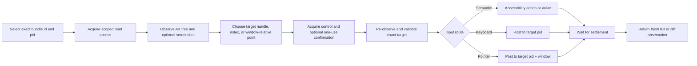

# DSH Computer Use

[](https://x.com/anion_ex)
[](LICENSE)


**Native macOS control for DeepSeek Harness that keeps your real cursor and foreground application alone by default; the Bundle may bring the target app forward before keyboard input for reliable typing.**

DSH Computer Use gives an Agent fresh Accessibility observations, exact process/window targeting, stale-state rejection, scoped application access, and verified post-action state. Semantic Accessibility comes first; mouse, drag, wheel, and keyboard fallback are routed to the selected process instead of the global desktop.

English | [中文](README.zh.md)

## Why it is different

Accessibility permission lets a process inspect and operate macOS UI elements, but the permission itself does not prevent focus stealing or cursor movement. Those behaviors depend on the input route.

The default DSH Computer Use route is deliberately non-interfering:

- **No system-cursor movement:** the helper contains no cursor-warp path.
- **No global pointer injection:** click, scroll, and drag fallback use a pid/window-targeted SkyLight route, not the global HID event stream.
- **No pointer-triggered activation:** semantic Accessibility, process-targeted pointer input, and `keyboardPolicy: preserve` run without activation; `keyboardPolicy: activate` (Bundle default) brings the target app forward before keyboard fallback, matching Codex Computer Use.
- **A separate Agent cursor:** click, scroll, and drag actions animate a click-through, nonactivating software cursor while the macOS system cursor remains untouched. It is visible by default and stays at the action position until the bound window changes or a hide command; `cursorAutoHideMs` can opt into timed auto-hide.
- **No blind replay:** every action is tied to an exact, unexpired observation and returns fresh state.

The result is a native action layer that can operate many background applications while the user continues working in the current foreground application.

## What it adds

- **Observe before acting.** Return a bounded Accessibility tree, indexed elements, exact app/process/window metadata, permission state, and an optional screenshot Artifact.
- **Bind actions to state.** Every element exposes an observation-local index and opaque `targetHandle`; exact lookup remains compatible, while explicitly allowed rebinding accepts only a unique native or semantic identity inside the same process and window.
- **Prefer semantic input.** Use `AXPress`, editable values, selected-text assignment, and advertised Accessibility actions before pointer fallback.
- **Route fallback to the target.** Keyboard input goes to the selected pid; pointer input goes to the selected pid and `CGWindowID` with window-local coordinates, resolving the app window under the point so arbitrary screen coordinates work.
- **Return fresh evidence.** Every successful action settles for a bounded interval and returns a new full or diff observation.
- **Scope application access.** Read and control leases are separated by Agent, Session, turn, and exact bundle id; high-impact actions require one-use confirmation.
- **Keep the model surface focused.** Execution Tools appear only after the current Agent loads the Computer Use Skill.

## Proof: a never-active background fixture

The repository includes a deterministic AppKit fixture and a universal native helper. Release tests start the fixture with `open -g` in background mode, then use the same protocol exposed to the Agent.

```text
observe exact bundle id + pid
-> element: "Targeted pointer probe", no AXPress action
-> computer_click with observationId + element index + allowCoordinateFallback
-> fresh observation
-> activation "not-requested"; pointerRouting "target-process"
-> status "Status: pointer click"
```

<p align="center">
  
</p>

The fixture records every `applicationDidBecomeActive` callback. An independent native monitor also samples the system cursor and frontmost pid every millisecond throughout click, scroll, and drag. The default release path must not increase `activationCount`; it also requires unchanged cursor coordinates, an unchanged frontmost pid, exact click/scroll counts, and one complete down/up drag gesture.

See [Foreground-safe input policy](docs/interaction-policy.md) for the requirements, architecture, decisions, evidence, and compatibility limits.

## Scope

`dsh-computer-use` is the native **action layer**. It does not replace narrower interfaces:

- browser tasks should use browser automation and DOM/CDP state;
- APIs, CLIs, and purpose-built application plugins remain preferable when available;
- OCR, visual grounding, and pixel interpretation should use the separately installed `dsh-vision-toolkit`: load the `vision-tools` Skill and pass the exact screenshot Artifact path to `vision_glance`, `vision_ground`, `vision_detect`, `vision_crop`, or `vision_long_screenshot_ocr`; do not replace those tools with shell-driven `tesseract`, `screencapture`, or ad hoc Swift/Python OCR;
- domain bundles such as `dsh-design` can compose Computer Use when a workflow crosses into a native application.

## Quick start

### Prerequisites

- macOS 14 or newer.
- DeepSeek Harness with a Web or Headless Profile and the Skill Tool mounted.
- macOS Accessibility permission for observation and native actions.
- macOS Screen Recording permission only when a screenshot is requested.
- Node.js `^22.19.0` or `>=24.0.0` when building this repository.

Install the Web and Headless bundles directly from npm:

```sh
dsh plugin --profile web add @anionex/dsh-computer-use
dsh plugin --profile headless add @anionex/dsh-computer-use

dsh --profile web --dump-config | grep computer-use
dsh --profile headless --dump-config | grep computer-use
```

For local development, replace the package name with an absolute checkout path.

Restart a running `dsh web` host after changing the installed plugin, then start a new Session so the host reloads the Bundle and Skill catalog.

Load the Skill in that Session:

```text
/computer-use
```

Then try:

> Use Computer Use to inspect the running DSH Computer Use Fixture, enable its deterministic option, and report the fresh status. Prefer Accessibility elements and do not reuse an old observation.

## How it works



Every observed element has an observation-local compatibility index and an opaque `targetHandle`. Index-only actions retain exact locator behavior. A low-risk element action may pass `targetHandle` with `allowRebind: true`; immediately before input, the provider-independent resolver obtains fresh Accessibility state and checks, in order, the original locator, a unique provider-native identifier such as macOS `AXIdentifier`, then one unique semantic match over role, accessible name, advertised actions, and stable ancestor fingerprint. The resolver keeps the exact bundle id, pid, and selected-window identity, and fails closed with `COMPUTER_TARGET_AMBIGUOUS` or `COMPUTER_TARGET_LOW_CONFIDENCE` instead of guessing. Coordinate actions still require the complete referenced window state to remain current.

Successful element actions report `resolution.mode`, `confidence`, `candidateCount`, and `targetChanged`. A sensitive target that needs rebinding invalidates the prior one-use confirmation and returns `COMPUTER_TARGET_REBIND_REQUIRES_CONFIRMATION`; the caller must observe the current UI and confirm the newly selected handle. Visual coordinates are not target handles and never authorize sensitive rebinding. Provider-native visual hit-testing is not part of this foundation release and remains follow-up work.

The default interaction policy is:

```yaml
interaction:
  focusPolicy: preserve
  keyboardPolicy: activate
  pointerInputPolicy: targeted
  cursorVisualization: visible
  cursorMotionMs: 180
  cursorAutoHideMs: 0
```

`cursorVisualization: visible` displays the Agent's own non-interactive cursor for click, scroll, and drag. It never replaces or moves the macOS system cursor. Set it to `hidden` when visual feedback is unwanted. `pointerInputPolicy: deny` disables coordinate click/fallback, scroll, and drag. `keyboardPolicy: activate` (Bundle default) makes `type-text` keyboard fallback and `press-key` reliable by activating the target app first; `focusPolicy: activate` is the broader compatibility mode that also activates before pointer input. After activation, the helper re-observes and revalidates the exact target before input.

The cursor is a 28x28 transparent whole-image cursor (Cursor arrow plus DeepSeek whale, `assets/cursor.png`) with the hotspot at the image's top-left corner. It is a separate process, click-through, nonactivating, and bound to the exact observed pid, window, and frame so it disappears if the target window closes, moves, resizes, or is minimized.

The helper executable is an internal DSH transport rather than a public authorization API. It requires an isolated process group plus parent-owned standard transports, so ordinary shell redirection fails closed before command parsing. This is defense in depth, not authentication against arbitrary code running as the same macOS user: a deliberately constructed detached parent can reproduce that transport topology. Use the registered Tools so application leases, sensitive-action confirmation, and host policy checks remain in force; `danger-full-access` must not be treated as protection against direct native invocation.

Successful action results include:

```ts
activation: 'not-requested' | 'already-frontmost' | 'activated'
pointerInput: boolean
pointerRouting: 'none' | 'target-process'
resolution?: {
  mode: 'exact-locator' | 'native-identifier' | 'semantic-rebind'
  confidence: number
  candidateCount: number
  targetChanged: boolean
}
```

The model cannot override these host policies through Tool arguments.

## Model Tools

The Bundle initially contributes only `computer_use_activate`. Loading the Skill exposes the focused execution vocabulary for that Agent.

<details>
<summary>Show the complete Tool vocabulary</summary>

| Tool | Purpose |
|---|---|
| `computer_list_apps` | List bounded user-facing applications with bundle id, pid, frontmost state, and permission diagnostics |
| `computer_observe` | Return a fresh full/diff Accessibility observation and optional screenshot Artifact |
| `computer_click` | Prefer `AXPress`; accept an exact index or opaque target handle, with optional safe rebinding, before target-process coordinate fallback |
| `computer_set_value` | Set or clear an editable Accessibility value through an exact index or opaque target handle without using the clipboard |
| `computer_type_text` | Insert Unicode through Accessibility when supported, with a process-targeted keyboard fallback |
| `computer_press_key` | Send one key from a finite vocabulary to the selected process, with optional modifiers |
| `computer_scroll` | Send bounded directional scrolling to the selected process and window at a resolved element or window/screen coordinate |
| `computer_drag` | Drag between two window/screen points in the referenced observation |
| `computer_perform_action` | Execute one Accessibility action advertised by an exact or safely rebound selected element |
| `computer_wait` | Poll one bounded text/role/title condition and return fresh state without modifying the app |
| `computer_confirm` | Obtain a one-use token bound to one exact sensitive action |

No Tool accepts AppleScript, JXA, shell, Swift, Objective-C, native selectors, arbitrary Accessibility constants, or source code.

</details>

## Observation, permissions, and sensitive actions

An observation contains an opaque id and expiry, exact app identity, frontmost/window metadata, bounded tree text, current elements with opaque target handles, optional screenshot metadata, and permission state. Target handles expose no provider object reference or native identifier. Secure text values are emitted as `[secure]`; they do not enter target descriptors, tree text, Tool results, screenshot metadata, or native errors. A screenshot can still contain other visible application data and should be treated as sensitive.

The technical access model has two exact-bundle-id leases:

- `read`: inspect Accessibility state and a requested screenshot;
- `control`: send UI input to the selected application.

Without a configured grant, DSH asks for approval. Read approval lasts for the Session; control approval lasts for the current turn. A user rejection is final for that app and scope for the rest of the Session.

The Bundle keeps Session-wide read grants and rejected app/scope decisions in its own `computer_use_state` storage-domain sidecar, fenced by the Session header's `createdAt` and `cwd`. It does not add Computer Use events to the official Session log or modify DSH Core. The Web Profile already composes `@deepseek-ai/dsh-storage-domain`; a custom Profile must compose it before this Bundle if interactive read grants or durable rejections are needed. Exact grants configured in Settings remain available without storage-domain, and an allowed control decision remains process-local for the current turn. When a durable interactive decision cannot be stored, the operation fails clearly instead of silently weakening its lifetime.

The DSH `danger-full-access` preset uses `approval/policy: never`, so an ungranted app is policy-blocked before any prompt. The plugin reports an actionable `COMPUTER_PERMISSION_REQUIRED` error and does not record that outcome as a user rejection. Add the exact bundle id in Computer Use Settings or use a preset whose approval policy is `ask`.

High-impact communication, sensitive-data transmission, irreversible deletion, account/security/privacy changes, unrequested installation, legal acceptance, and financial completion beyond explicit authorization require `computer_confirm` immediately before execution. The token is short-lived, one-use, and bound to the exact app, process, observation, target handle, and action. Grants do not bypass it. If resolution moves beyond the exact locator, the token is invalidated and a fresh observation plus confirmation is required.

## macOS permissions and native integrity

The Web Settings section reports helper integrity, Accessibility and Screen Recording status, active generation, interaction policy, limits, and exact application grants. Its buttons can open the relevant macOS privacy pane after a user click; the plugin cannot grant TCC permission itself.

Accessibility and Screen Recording are UI permissions, not filesystem permissions. Normal use stays under DSH `workspace-write`: screenshots remain in the Session workspace, transient files use Session-private temporary storage, and the Bundle does not require `danger-full-access`.

The committed helper is an ad-hoc-signed universal `arm64` + `x86_64` binary targeting macOS 14 or newer. [`native/macos/manifest.json`](native/macos/manifest.json) pins its SHA-256, source digest, architectures, and deployment target. `pnpm run check:native` also checks the target-process-only pointer route and rejects system-cursor warp or global pointer-post symbols.

## Configuration

<details>
<summary>Show Bundle configuration fields</summary>

| Field | Purpose |
|---|---|
| `observationTtlMs` | Lifetime of an observation before reuse is rejected; default `0` disables expiry, or set any value up to `86400000` ms (24 hours) |
| `confirmationTtlMs` | Lifetime of a one-use sensitive-action confirmation |
| `actionTimeoutMs` | Hard native action timeout from `1000` to `120000` ms |
| `settleMs` | Interval between post-action state checks from `0` to `10000` ms |
| `maxSettleMs` | Maximum post-action settlement budget from `100` to `60000` ms |
| `maxNodes` / `maxDepth` / `maxTextBytes` | Accessibility traversal and model-visible text bounds |
| `maxScreenshotBytes` | Maximum PNG Artifact size |
| `artifactRoot` | Workspace-relative screenshot directory |
| `helper.path` | Optional explicit external helper executable |
| `helper.allowSourceBuild` | Permit an explicit managed-source rebuild when the committed helper is absent; default `false` |
| `interaction.focusPolicy` | `preserve` (default) avoids target-app activation; `activate` explicitly permits it and requires re-observation/revalidation |
| `interaction.keyboardPolicy` | `preserve` keeps keyboard events routed without activation; `activate` (Bundle default) activates the target app before keyboard fallback |
| `interaction.pointerInputPolicy` | `targeted` (default) permits pid/window-targeted pointer input; `deny` disables click fallback, scroll, and drag |
| `interaction.cursorVisualization` | `visible` (default) shows the separate Agent cursor; `hidden` disables only the overlay |
| `interaction.cursorMotionMs` | Animated Agent-cursor travel duration, default `180` ms |
| `interaction.cursorAutoHideMs` | Idle time before the Agent cursor hides; default `0` keeps it visible until the bound window changes or a hide command, or set a finite value up to `30000` ms |
| `allowAllApps` | Grant `read` and `control` to every running app; default `false`. When enabled, exact `grants` are ignored |
| `grants` | Exact non-wildcard bundle-id read/control policy; `control: true` implies read |

</details>

Settings updates replace the active provider generation only after validation and health checks pass. Replacement invalidates existing observations and pending confirmations.

## Status and limitations

- Status: early `0.1.0`; model-facing and provider behavior may change before a stable release.
- The current provider is macOS-only. Windows UI Automation and Linux providers are not implemented.
- Target-process pointer delivery uses dynamically resolved SkyLight SPI. If it is unavailable, pointer fallback fails closed rather than switching to global input.
- The clicked point must fall inside an on-screen window of the selected app; the helper resolves the topmost matching window so ambiguous frame/title matches no longer block coordinate actions. Minimized, hidden, or windowless targets fail closed.
- Custom canvases, games, hardened input surfaces, and future macOS releases may reject target-process pointer or keyboard events. Prefer semantic Accessibility whenever possible.
- `focusPolicy: activate` and `keyboardPolicy: activate` are intentionally disruptive and exist as operator-selected compatibility modes.
- A target application may change its own activation or focus as a side effect of an accepted action.
- The package captures requested discrete observations, not a live desktop feed.
- Browser work should continue to use browser automation because DOM/CDP state is narrower and more precise.
- The public npm package installs into both Web and Headless profiles as `@anionex/dsh-computer-use`.

## Development and release verification

Place this repository beside a DeepSeek Harness checkout so TypeScript and Vitest resolve the exact DSH peer declarations and runtime modules:

```text
workspace/
├── packages/
├── vendor/
└── dsh-computer-use/
```

Then run:

```sh
pnpm install --frozen-lockfile
pnpm run build
DSH_COMPUTER_USE_REQUIRE_TCC=1 pnpm test
pnpm run check:native
pnpm pack --dry-run
pnpm run validate
```

`pnpm run validate` runs the keyless local and clean Web/Headless Profile lanes. The real-model release lane needs `DEEPSEEK_API_KEY` and accepts an optional `DEEPSEEK_BASE_URL`:

```sh
pnpm run validate:model
# or keyless validation followed by the real-model lane
pnpm run validate:release
```

## Removal

```sh
dsh plugin --profile web remove @anionex/dsh-computer-use
dsh plugin --profile headless remove @anionex/dsh-computer-use
```

Removing or disabling the Bundle unregisters the Skill and Tools, cancels helper work, releases process-local Agent observations, turn control grants, and confirmations, closes its storage-domain handle, and removes Web contributions. Existing screenshot files and the plugin-owned `computer_use_state` sidecar remain for explicit user cleanup.

## Security, community, and support

- Report suspected vulnerabilities privately through [SECURITY.md](SECURITY.md).
- Read [CONTRIBUTING.md](CONTRIBUTING.md) before changing code or documentation.
- Use [SUPPORT.md](SUPPORT.md) for installation, permission, configuration, and workflow questions.
- Follow the [Code of Conduct](CODE_OF_CONDUCT.md) in project spaces.
- See [CHANGELOG.md](CHANGELOG.md) for release history.
- See [FUNDING.md](FUNDING.md) to support maintenance without purchasing roadmap control or private support.

## About

DSH Computer Use is maintained by [anionex](https://anionex.me/). If you would like to follow my future work, [follow me on X](https://x.com/anion_ex) or [GitHub](https://github.com/Anionex).

## License

[MIT](LICENSE) © 2026 anionex.
