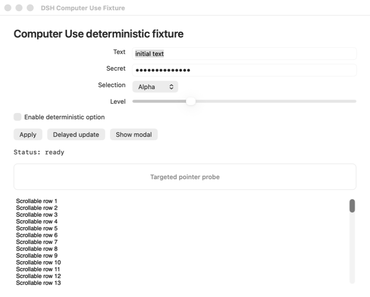
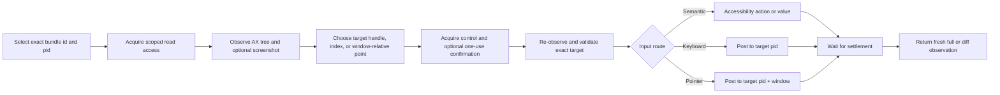

# DSH Computer Use

[](https://x.com/anion_ex)
[](LICENSE)


**为 DeepSeek Harness 提供原生 macOS 控制能力，默认不碰你的真实光标，也不因指针动作抢占前台；Bundle 可以在键盘输入前把目标应用带到前台，保证输入可靠。**

DSH Computer Use 为 Agent 提供新鲜的 Accessibility observation、准确进程/窗口定向、stale state 拒绝、按应用限制的访问，以及动作后的可验证状态。语义化 Accessibility 始终优先；鼠标、拖拽、滚轮与键盘 fallback 会投递给选定进程，而不是全局桌面。

[English](README.md) | 中文

## 为什么它不同

Accessibility 权限允许进程读取和操作 macOS UI 元素，但这个权限本身并不会自动防止抢焦点或移动光标。是否干扰用户，取决于输入事件走哪条路由。

DSH Computer Use 的默认路由有意避免干扰：

- **不移动系统光标：** helper 中没有 cursor warp 路径。
- **不做全局指针注入：** click、scroll 与 drag fallback 使用 pid/window 定向的 SkyLight 路由，不进入全局 HID 事件流。
- **指针动作不激活应用：** 语义化 Accessibility、目标进程指针输入与 `keyboardPolicy: preserve` 都不激活；`keyboardPolicy: activate`（Bundle 默认）在键盘 fallback 前把目标应用带到前台，与 Codex Computer Use 对齐。
- **独立 Agent 光标：** click、scroll 与 drag 动作会移动一个点击穿透、不会激活应用的软件光标，同时保持系统真实光标不变。默认显示，并停留在动作落点，直到绑定窗口变化或收到 hide 命令；`cursorAutoHideMs` 可开启定时自动隐藏。
- **不盲目重放：** 每个动作都绑定准确、未过期的 observation，并返回新鲜状态。

因此，这个原生动作层可以在用户继续使用当前前台应用时，操作许多后台应用。

## 它补充了什么

- **先观察再动作。** 返回有界 Accessibility tree、带 index 的元素、准确 app/process/window metadata、权限状态和可选截图 Artifact。
- **把动作绑定到状态。** 每个元素都带有 observation-local index 与 opaque `targetHandle`；准确 locator 继续兼容，而显式允许的重绑定只接受同一进程和窗口内唯一的 native 或 semantic 身份。
- **优先语义输入。** 先使用 `AXPress`、可编辑 value、selected-text 赋值和元素声明的 Accessibility action，再考虑指针 fallback。
- **把 fallback 投递给目标。** 键盘输入发给选定 pid；指针输入携带窗口本地坐标，发给选定 pid 和 `CGWindowID`，并通过点解析应用窗口，任意屏幕坐标都可以点击。
- **返回新鲜证据。** 每个成功动作都会经过有界 settle，并返回新的完整或差分 observation。
- **按应用限制访问。** read/control lease 按 Agent、Session、turn 与准确 bundle id 分离；高影响动作另需一次性确认。
- **保持模型表面聚焦。** 只有当前 Agent 加载 Computer Use Skill 后才暴露执行 Tool。

## 证据：从未激活的后台 fixture

仓库包含确定性 AppKit fixture 和 universal native helper。发布测试会通过 `open -g` 以后台模式启动 fixture，再通过 Agent 使用的同一协议完成操作。

```text
observe exact bundle id + pid
-> element: "Targeted pointer probe", no AXPress action
-> computer_click with observationId + element index + allowCoordinateFallback
-> fresh observation
-> activation "not-requested"; pointerRouting "target-process"
-> status "Status: pointer click"
```

<p align="center">
  
</p>

Fixture 会记录每次 `applicationDidBecomeActive` 回调。独立 native monitor 还会在 click、scroll 与 drag 整个动作期间每毫秒采样系统光标和前台 pid。默认发布路径不得增加 `activationCount`，并要求光标坐标不变、前台 pid 不变、click/scroll 精确计数，并且 drag 只有一组完整 down/up gesture。

需求、架构、关键决策、验证证据和兼容性边界见[前台安全输入策略](docs/interaction-policy.md)。

## 范围

`dsh-computer-use` 是原生**动作层**，不会取代更窄的接口：

- 浏览器任务应继续使用 browser automation 和 DOM/CDP 状态；
- 有 API、CLI 或专用应用插件时仍应优先使用；
- OCR、视觉 grounding 与像素理解应交给独立安装的 `dsh-vision-toolkit`：加载 `vision-tools` Skill，把准确的截图 Artifact 路径传给 `vision_glance`、`vision_ground`、`vision_detect`、`vision_crop` 或 `vision_long_screenshot_ocr`；不要用 shell 驱动的 `tesseract`、`screencapture` 或临时 Swift/Python OCR 取代这些工具；
- `dsh-design` 等领域 Bundle 可以在工作流跨入原生应用时组合 Computer Use。

## 快速开始

### 前置条件

- macOS 14 或更新版本。
- 已安装 Web 或 Headless Profile、并挂载 Skill Tool 的 DeepSeek Harness。
- 用于观察和原生动作的 macOS Accessibility 权限。
- 只有请求截图时才需要 macOS Screen Recording 权限。
- 构建本仓库时需要 Node.js `^22.19.0` 或 `>=24.0.0`。

直接从 npm 一键安装 Web 与 Headless Bundle：

```sh
dsh plugin --profile web add @anionex/dsh-computer-use
dsh plugin --profile headless add @anionex/dsh-computer-use

dsh --profile web --dump-config | grep computer-use
dsh --profile headless --dump-config | grep computer-use
```

本地开发时，把包名替换为 checkout 的绝对路径即可。

修改已安装插件后，需要重启正在运行的 `dsh web` host，再创建一个新 Session，让 host 重新载入 Bundle 与 Skill catalog。

在新 Session 中加载 Skill：

```text
/computer-use
```

然后可以尝试：

> 使用 Computer Use 检查正在运行的 DSH Computer Use Fixture，启用 deterministic option，并根据动作后返回的新状态报告结果。优先使用 Accessibility 元素，不要复用旧 observation。

## 工作原理



每个已观察元素都有 observation-local 兼容 index 和 opaque `targetHandle`。仅传 index 的动作保留准确 locator 行为。低风险元素动作可以传入 `targetHandle` 与 `allowRebind: true`；输入前，provider-independent resolver 会获取新鲜 Accessibility 状态，并依次检查原 locator、唯一 provider-native identifier（例如 macOS `AXIdentifier`），以及基于 role、accessible name、已声明 action 和稳定 ancestor fingerprint 的唯一 semantic match。Resolver 始终保留准确 bundle id、pid 与选定窗口身份；遇到歧义或低置信度时返回 `COMPUTER_TARGET_AMBIGUOUS` 或 `COMPUTER_TARGET_LOW_CONFIDENCE`，不会猜测。坐标动作仍要求引用窗口的完整状态保持当前。

成功的元素动作会报告 `resolution.mode`、`confidence`、`candidateCount` 与 `targetChanged`。敏感目标一旦需要 rebind，旧的一次性 confirmation 会失效，并返回 `COMPUTER_TARGET_REBIND_REQUIRES_CONFIRMATION`；调用方必须观察当前 UI，并对新选择的 handle 再次确认。视觉坐标不是 target handle，不能授权敏感 rebind。本基础版本不包含 provider-native visual hit-test，该能力留待后续实现。

默认 interaction policy 为：

```yaml
interaction:
  focusPolicy: preserve
  keyboardPolicy: activate
  pointerInputPolicy: targeted
  cursorVisualization: visible
  cursorMotionMs: 180
  cursorAutoHideMs: 0
```

`cursorVisualization: visible` 会在 click、scroll 与 drag 时显示 Agent 自己的非交互光标；它不会替代或移动 macOS 系统光标。不需要视觉反馈时可设为 `hidden`。`pointerInputPolicy: deny` 会禁用坐标点击/fallback、滚动与拖拽。`keyboardPolicy: activate`（Bundle 默认）会先激活目标应用，让 `type-text` 键盘 fallback 与 `press-key` 可靠工作；`focusPolicy: activate` 是更宽的兼容模式，还会在指针输入前激活。激活后 helper 会重新观察并校验准确目标，之后才发出输入。

Agent 光标是 28x28 的透明整图光标（Cursor 箭头加 DeepSeek 鲸鱼，`assets/cursor.png`），热点位于图片左上角。它由独立进程运行，点击穿透、不激活应用，并绑定准确已观察的 pid、窗口与 frame；目标窗口关闭、移动、缩放或最小化时会自动隐藏。

Helper executable 是 DSH 内部传输实现，不是公共授权 API。它要求独立进程组和父进程持有的标准传输，因此普通 shell 重定向会在解析命令前 fail closed。这个检查只属于纵深防御，不会认证同一 macOS 用户下运行的任意代码：专门构造的 detached 父进程仍能复现这类传输拓扑。应通过已注册 Tool 使用该能力，以保留应用 lease、敏感动作 confirmation 与宿主策略检查；不能把 `danger-full-access` 当作阻止直接 native 调用的保护。

成功动作结果包括：

```ts
activation: 'not-requested' | 'already-frontmost' | 'activated'
pointerInput: boolean
pointerRouting: 'none' | 'target-process'
resolution?: {
  mode: 'exact-locator' | 'native-identifier' | 'semantic-rebind'
  confidence: number
  candidateCount: number
  targetChanged: boolean
}
```

模型不能通过 Tool 参数覆盖这些宿主策略。

## 模型 Tool

Bundle 初始只贡献 `computer_use_activate`。加载 Skill 后，才为当前 Agent 暴露聚焦的执行 vocabulary。

<details>
<summary>查看完整 Tool 列表</summary>

| Tool | 用途 |
|---|---|
| `computer_list_apps` | 列出有界用户应用及 bundle id、pid、前台状态和权限诊断 |
| `computer_observe` | 返回新鲜的 full/diff Accessibility observation 与可选截图 Artifact |
| `computer_click` | 优先使用 `AXPress`；接受准确 index 或 opaque target handle，并可在目标进程坐标 fallback 前执行安全 rebind |
| `computer_set_value` | 通过准确 index 或 opaque target handle 设置或清空可编辑 Accessibility value，不使用剪贴板 |
| `computer_type_text` | 支持时通过 Accessibility 插入 Unicode，否则使用进程定向键盘 fallback |
| `computer_press_key` | 向选定进程发送有限词表中的按键，并支持可选 modifier |
| `computer_scroll` | 在已解析元素或窗口/屏幕坐标处向选定进程与窗口发送有界方向滚动 |
| `computer_drag` | 在引用 observation 的窗口/屏幕两点之间拖拽 |
| `computer_perform_action` | 执行准确或安全 rebind 后的选定元素所声明的 Accessibility action |
| `computer_wait` | 轮询一个有界 text/role/title 条件，不修改应用并返回新鲜状态 |
| `computer_confirm` | 获取绑定准确敏感动作的一次性 token |

任何 Tool 都不接受 AppleScript、JXA、shell、Swift、Objective-C、native selector、任意 Accessibility constant 或源码。

</details>

## Observation、权限与敏感动作

Observation 包含 opaque id 与过期时间、准确 app 身份、frontmost/window metadata、有界 tree text、带 opaque target handle 的当前元素、可选截图 metadata 和权限状态。Target handle 不暴露 provider object reference 或 native identifier。Secure text value 以 `[secure]` 输出，不会进入 target descriptor、tree text、Tool result、截图 metadata 或 native error。截图仍可能包含应用中其他可见数据，应按敏感数据处理。

技术访问模型包含两类准确 bundle-id lease：

- `read`：读取 Accessibility 状态和请求的截图；
- `control`：向选定应用发送 UI 输入。

没有配置 grant 时，DSH 会请求 approval。Read approval 在 Session 内有效，control approval 只在当前 turn 有效。用户拒绝后，该 app/scope 在当前 Session 内保持最终结果。

Bundle 把 Session 级 read grant 和被拒绝的 app/scope 决定保存在自己拥有的 `computer_use_state` storage-domain sidecar 中，并用 Session header 的 `createdAt` 与 `cwd` 绑定准确生命周期；它不会向官方 Session 日志新增 Computer Use event，也不会修改 DSH Core。Web Profile 已经组合 `@deepseek-ai/dsh-storage-domain`；自定义 Profile 如果需要交互式 read grant 或持久拒绝状态，必须在本 Bundle 之前组合它。Settings 中配置的准确 grant 在没有 storage-domain 时仍可使用；获准的 control 决定只保存在当前进程的当前 turn。需要持久化的交互决定如果无法保存，操作会明确失败，不会静默缩短或削弱授权生命周期。

DSH `danger-full-access` preset 使用 `approval/policy: never`，因此未授权应用会在弹窗前被策略阻断。插件返回可操作的 `COMPUTER_PERMISSION_REQUIRED` 错误，并且不会把它记录成用户拒绝。请在 Computer Use Settings 中添加准确 bundle id，或改用 approval policy 为 `ask` 的 preset。

高影响外部通信、敏感数据传输、不可逆删除、账户/安全/隐私变更、未经请求的安装、法律条款接受，以及超出明确授权的财务完成动作，都需要在执行前立即调用 `computer_confirm`。Token 有短 TTL、只能使用一次，并绑定准确 app、process、observation、target handle 与 action；grant 不能绕过它。只要 resolution 不再使用原 locator，该 token 就会失效，必须重新观察并再次确认。

## macOS 权限与 native 完整性

Web Settings 分区展示 helper 完整性、Accessibility 与 Screen Recording 状态、当前 generation、interaction policy、限制和准确应用 grant。只有用户点击后，按钮才会打开相关 macOS 隐私页面；插件不能自行授予 TCC 权限。

Accessibility 与 Screen Recording 是 UI 权限，不是文件系统权限。正常使用保持在 DSH `workspace-write` 下：截图留在 Session workspace，临时文件使用 Session 私有临时目录，Bundle 不要求 `danger-full-access`。

仓库提交的 helper 是最低支持 macOS 14、ad-hoc 签名的 `arm64` + `x86_64` universal binary。[`native/macos/manifest.json`](native/macos/manifest.json) 固定其 SHA-256、源码 digest、架构与 deployment target。`pnpm run check:native` 还会检查只有目标进程指针路由，并拒绝系统光标 warp 或全局指针 post symbol。

## 配置

<details>
<summary>查看 Bundle 配置字段</summary>

| 字段 | 用途 |
|---|---|
| `observationTtlMs` | observation 允许复用的生命周期；默认 `0` 关闭过期，也可设为最大 `86400000` ms（24 小时）内的任意值 |
| `confirmationTtlMs` | 一次性敏感动作 confirmation 的生命周期 |
| `actionTimeoutMs` | `1000` 到 `120000` ms 的 native action 硬超时 |
| `settleMs` | `0` 到 `10000` ms 的动作后状态检查间隔 |
| `maxSettleMs` | `100` 到 `60000` ms 的动作后 settle 最大预算 |
| `maxNodes` / `maxDepth` / `maxTextBytes` | Accessibility 遍历与模型可见文本上限 |
| `maxScreenshotBytes` | PNG Artifact 最大字节数 |
| `artifactRoot` | workspace 内的相对截图目录 |
| `helper.path` | 可选的显式外部 helper executable |
| `helper.allowSourceBuild` | 提交 helper 缺失时允许显式托管源码重建；默认 `false` |
| `interaction.focusPolicy` | `preserve`（默认）避免激活目标应用；`activate` 显式允许激活，并要求重新观察/校验 |
| `interaction.keyboardPolicy` | `preserve` 不激活地把键盘事件定向投递；`activate`（Bundle 默认）在键盘 fallback 前激活目标应用 |
| `interaction.pointerInputPolicy` | `targeted`（默认）允许 pid/window 定向指针输入；`deny` 禁用 click fallback、scroll 和 drag |
| `interaction.cursorVisualization` | `visible`（默认）显示独立 Agent 光标；`hidden` 只关闭 overlay，不影响输入 |
| `interaction.cursorMotionMs` | Agent 光标移动动画时长，默认 `180` 毫秒 |
| `interaction.cursorAutoHideMs` | Agent 光标空闲后隐藏时间；默认 `0` 表示保持显示，直到绑定窗口变化或收到 hide 命令，也可设为最大 `30000` ms 内的有限值 |
| `allowAllApps` | 向所有运行中的应用授予 `read` 与 `control`；默认 `false`。开启后忽略精确 `grants` |
| `grants` | 准确、无通配符的 bundle-id read/control policy；`control: true` 隐含 read |

</details>

Settings 更新只有在校验与健康检查通过后才替换当前 provider generation；替换会使已有 observation 与待用 confirmation 失效。

## 状态与限制

- 状态：早期 `0.1.0`；稳定版本发布前，模型可见和 provider 行为仍可能变化。
- 当前 provider 只支持 macOS；Windows UI Automation 和 Linux provider 尚未实现。
- 目标进程指针投递使用动态解析的 SkyLight SPI。该路由不可用时，pointer fallback 会 fail closed，不会切换到全局输入。
- 点击点必须落在选定应用的某个屏幕内窗口中；helper 会解析该点下最上层的匹配窗口，frame/title 匹配有歧义不再阻塞坐标动作。最小化、隐藏或无窗口目标会 fail closed。
- 自定义 canvas、游戏、强化输入 surface 与未来 macOS 版本可能拒绝目标进程指针或键盘事件。应尽量优先使用语义化 Accessibility。
- `focusPolicy: activate` 与 `keyboardPolicy: activate` 会有意打断前台工作，只作为操作方显式选择的兼容模式。
- 目标应用可能因接受动作而自行改变 activation 或 focus。
- 软件包按请求捕获离散 observation，不提供实时桌面流。
- 浏览器工作应继续使用 browser automation，因为 DOM/CDP 状态更窄、更精确。
- 公共 npm 包以 `@anionex/dsh-computer-use` 安装，可同时挂载到 Web 与 Headless Profile。

## 开发与发布验收

请把仓库放在 DeepSeek Harness checkout 旁边，让 TypeScript 与 Vitest 解析准确的 DSH peer declaration 和 runtime module：

```text
workspace/
├── packages/
├── vendor/
└── dsh-computer-use/
```

随后运行：

```sh
pnpm install --frozen-lockfile
pnpm run build
DSH_COMPUTER_USE_REQUIRE_TCC=1 pnpm test
pnpm run check:native
pnpm pack --dry-run
pnpm run validate
```

`pnpm run validate` 会运行 keyless local lane 和干净 Web/Headless Profile lane。真实模型发布 lane 需要 `DEEPSEEK_API_KEY`，并支持可选的 `DEEPSEEK_BASE_URL`：

```sh
pnpm run validate:model
# or keyless validation followed by the real-model lane
pnpm run validate:release
```

## 移除

```sh
dsh plugin --profile web remove @anionex/dsh-computer-use
dsh plugin --profile headless remove @anionex/dsh-computer-use
```

移除或禁用 Bundle 会注销 Skill 与 Tool、取消 helper 工作、释放进程内 Agent observation、turn control grant 与 confirmation、关闭 storage-domain handle，并移除 Web contribution。已经生成的截图文件和插件自有的 `computer_use_state` sidecar 会保留，供用户显式清理。

## 安全、社区与支持

- 潜在漏洞按 [SECURITY.md](SECURITY.md) 私下报告。
- 修改代码或文档前请阅读 [CONTRIBUTING.md](CONTRIBUTING.md)。
- 安装、权限、配置和工作流问题见 [SUPPORT.md](SUPPORT.md)。
- 在项目空间中遵守 [Code of Conduct](CODE_OF_CONDUCT.md)。
- 版本记录见 [CHANGELOG.md](CHANGELOG.md)。
- 维护支持方式见 [FUNDING.md](FUNDING.md)，赞助不购买 roadmap 控制权或私有支持。

## 关于

DSH Computer Use 由 [anionex](https://anionex.me/) 维护。如果你想了解我后续的更多工作，欢迎在 [X](https://x.com/anion_ex) 或 [GitHub](https://github.com/Anionex) 关注我。

## 许可证

[MIT](LICENSE) © 2026 anionex。
