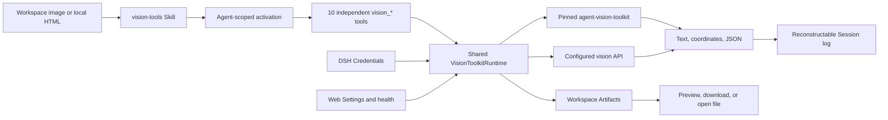

# DSH Vision Toolkit

[](https://x.com/anion_ex)
[](https://github.com/Anionex/dsh-vision-toolkit/releases/tag/v0.1.7)
[](tests)
[](LICENSE)
[](package.json)
[](runtime/requirements.lock)
[](cordis.patch.yml)

**Install:** `dsh plugin --profile web add @anionex/dsh-vision-toolkit`

**DSH Vision Toolkit brings [`agent-vision-toolkit`](https://github.com/Anionex/agent-vision-toolkit) into DeepSeek Harness as a native Profile Bundle.**

Give text-only DSH agents eyes—and keep vision in the harness—with intent-aware image Q&A, OCR, original-pixel grounding, UI restoration, pixel verification, managed Artifacts, and Web Settings. Ten independent tools replace shell glue with structured schemas and Agent-scoped progressive exposure.

**Upstream toolkit:** [Anionex/agent-vision-toolkit](https://github.com/Anionex/agent-vision-toolkit) · **Project website:** [agent-vision.anionex.me](https://agent-vision.anionex.me)

English | [中文](README.zh.md)

## Why this exists

`agent-vision-toolkit` treats vision as an Agent-callable capability rather than a property of the base model. Its method carries the reason for looking into the visual request, moves from the whole image to targeted regions, and verifies coordinates, colors, geometry, and differences with focused tools instead of accepting a generic description as evidence.

DSH Vision Toolkit preserves that method while replacing CLI installation and Bash argument construction with native schemas, DSH Credentials, lifecycle-managed runtime preparation, structured Session-log results, previewable Artifacts, dedicated Web cards, and Settings. The Agent loads one versioned Skill and receives the ten visual schemas only when the current task needs them.

The package delivers the committed P0 and P1 product scope. P2's stable `ctx.visionToolkit` service remains deliberately unpublished until an independent plugin becomes a real consumer; the internal runtime does not pretend that an unvalidated ecosystem API is stable.

## Proven use cases from agent-vision-toolkit

The first two panels are official upstream reference runs from the same pinned `agent-vision-toolkit` lineage packaged by this bundle. The image Q&A and screenshot-guided debugging panel is a live DeepSeek Harness Web session, showing the same workflows through DSH. See the [asset provenance record](assets/upstream/README.md) for the upstream source images.

### Infographic restoration: screenshot to editable HTML/CSS

<p align="center">
  
  
</p>

*Left: source screenshot. Right: the editable HTML/CSS result from the upstream [infographic-restoration reference](https://github.com/Anionex/agent-vision-toolkit/blob/c27d1a300962b553c0884993c575cd3e819465ce/examples/infographic-restoration/how-is-the-model-trained.html).*

### UI restoration: sketch to working interface

<p align="center">
  
  
</p>

*Left: hand-drawn input. Right: the upstream reconstructed interface; the complete method lives in the [UI restoration playbook](https://github.com/Anionex/agent-vision-toolkit/blob/c27d1a300962b553c0884993c575cd3e819465ce/skills/vision-tools/references/restore-ui.md).*

### Image Q&A and screenshot-guided debugging

<p align="center">
  
  
</p>

*Left: intent-aware image Q&A in DSH Web. Right: a DSH Web screenshot-debugging turn that lists the concrete UI differences and continues toward `vision_pixel_diff`. The upstream workflow source is the same [`agent-vision-toolkit` reference](https://github.com/Anionex/agent-vision-toolkit/blob/c27d1a300962b553c0884993c575cd3e819465ce/README.md#real-world-effects).*

DSH Vision Toolkit adds native tool schemas, versioned lifecycle, Credentials, structured Session results, Artifacts, Web presentation, Settings, and progressive exposure around these upstream capabilities. The next section is the reproducible proof executed and checked into this DSH repository.

## DSH-native proof: reference-to-pixel verification

The checked-in UI-restoration workflow renders an intentionally inaccurate HTML implementation, measures a `6.04%` pixel difference across six non-zero regions, iterates, and reaches an exact `0%` difference against the reference at `1200 × 720`.

<p>
  
  
</p>

| Verified surface | Evidence |
|---|---|
| Product scope | 10 independent visual tools, matching `vision-tools` Skill, Artifacts, dedicated Web cards, and live Settings |
| Automated coverage | 17 Vitest files / 136 passing tests, plus a dependency-free portable package check |
| Real profiles | Clean temporary Web and Headless installation, activation, disable, re-enable, and uninstall |
| Visual acceptance | Reproducible HTML screenshot → pixel diff example with a final `0%` difference |

## Highlights

- **See images without bloating every prompt:** only `vision_toolkit_activate` is initially visible; loading `vision-tools` mounts ten independent schemas for that Agent and keeps version/health administration out of model context.
- **Act on coordinates instead of parsing prose:** grounding and detection return original-image pixel boxes, while every model-visible result remains structured text or JSON.
- **Deliver files, not temporary output:** crop, trace, OCR, pixel diff, foreground extraction, and HTML rendering produce described Artifacts that the Web client can preview, download, or open locally.
- **Keep runtime and credentials controlled:** DSH Credentials hold API keys, managed mode prepares an exact isolated Python environment, and a failed Settings candidate cannot replace the serving generation.
- **Close the visual verification loop:** local HTML rendering and pixel-diff ranking support reference → implementation → screenshot → measured iteration without a model-native image channel.
- **Use the same bundle in Web and Headless profiles:** Web adds cards, previews, Settings, and health actions; Headless receives the same tool semantics and complete structured results.

## Quick start

Prerequisites: DeepSeek Harness `0.1.0-rc.6` or a compatible later `0.1.x` release, Python 3.11+, and `pnpm` available to `dsh plugin`. Install the published bundle from npm, add it to the profiles you use, and confirm the bundle row:

```sh
dsh plugin --profile web add @anionex/dsh-vision-toolkit
dsh plugin --profile headless add @anionex/dsh-vision-toolkit
dsh --profile web --dump-config | grep vision-toolkit
dsh --profile headless --dump-config | grep vision-toolkit
```

Legacy profiles must use `nodeLinker: hoisted` and `autoInstallPeers: false` in their `pnpm-workspace.yaml`. An updated DSH launcher repairs these owned settings before `dsh plugin` runs; when using an older launcher, set them before installation so pnpm does not assemble a second Harness dependency graph inside the profile.

Restart a running Web profile, open **Settings → Vision Toolkit**, select a DSH Credential for remote tools, and explicitly run **Test connection**. In a conversation, make an image available as a workspace path, invoke `/vision-tools`, and ask the Agent to call a specific `vision_*` tool. Local crop, trace, pixel, color, foreground, and HTML operations do not require a visual API credential.

## How it works



Tool definitions call one runtime; the runtime validates paths, limits, credentials, cancellation, and deadlines before dispatching to the pinned upstream snapshot or configured vision provider endpoint. Web presentation consumes the same structured results and Artifact descriptors, so it does not change Headless behavior. Health, connection testing, and version inspection stay in Settings rather than model tool schemas.

## Tools

| Tool | Execution | Structured result | Artifact delivery |
|---|---|---|---|
| `vision_glance` | Remote vision API | Description, targeted answer, OCR, or multi-image comparison | None |
| `vision_ground` | Remote vision API; optional local preview | Target, original-image dimensions, and pixel boxes | Optional labeled PNG |
| `vision_detect` | Remote vision API; optional local preview | Numbered element inventory and original-image pixel boxes | Optional numbered PNG |
| `vision_trace` | Local pinned vtracer pipeline | SVG geometry status, path count, scale, and size | SVG |
| `vision_crop` | Local Pillow pipeline | Applied pixel box, dimensions, format, and clamp status | PNG or JPEG |
| `vision_pixel_diff` | Local NumPy/Pillow pipeline | Difference percentage and ranked grid regions | PNG heatmap and JSON report |
| `vision_long_screenshot_ocr` | Local split/audit; remote OCR unless `splitOnly=true` | Chunk boundaries, reuse state, completion state, and run directory | Markdown, manifest, boundary audit, chunk PNGs, and OCR sidecars |
| `vision_extract_foreground` | Local pinned extraction pipeline | Selected box, component counts, foreground coverage, and dimensions | Transparent PNG |
| `vision_dominant_colors` | Local pinned color analysis | Extracted palette or pixel-backed candidate ranking | None |
| `vision_html_screenshot` | Local Chrome/Chromium/Edge adapter | Authorized source facts, viewport, and rendered dimensions | PNG |

The plugin does not reimplement visual algorithms. Its DSH-owned layer validates paths and limits, resolves credentials, calls the pinned upstream scripts with argv vectors, parses their exact output contracts, classifies failures, describes files, and projects results to the model and Web client.

## Progressive model exposure

Runtime readiness is profile-wide, but the ten visual execution schemas are Agent-scoped. Before an Agent loads `vision-tools`, the plugin contributes only the small `vision_toolkit_activate` bootstrap; the visual tools are absent from that Agent's request schema. A successful call to the standard `skill` tool with `name="vision-tools"` mounts all ten tools automatically for the next model step and hides the bootstrap. A direct `/vision-tools` invocation injects the Skill instructions; if the visual tools are still absent, those instructions require one `vision_toolkit_activate` call. Activation affects only that Agent, restores when the Session contains durable evidence matching the bundled Skill version, and lasts until the Agent or plugin is disposed.

Health checks, connection testing, and plugin/upstream version inspection are administrative Web Settings operations. `vision_toolkit_health` and `vision_toolkit_version` are not model tools and never enter an Agent's schema, including after visual-tool activation.

## Requirements

- DeepSeek Harness with a Web or Headless profile and `pnpm` available to `dsh plugin`.
- Python 3.11 or newer. Managed mode creates an isolated environment, so users do not install the upstream CLI or Python packages manually.
- Network access on the first managed-runtime activation unless the exact packages in `runtime/requirements.lock` are already available in the configured package cache.
- An OpenAI-compatible or Anthropic vision endpoint and DSH Credential for `vision_glance`, `vision_ground`, `vision_detect`, and non-split-only long-screenshot OCR. Local tools remain usable without that credential.
- Chrome, Chromium, or Edge only for `vision_html_screenshot`; all other tools remain available when no supported browser is installed.
- PNG, JPEG, GIF, or WebP inputs inside the session workspace or an explicitly configured `allowedDirs` root.

## Install and lifecycle

### Install

Install the bundle into each profile that should expose it:

```sh
dsh plugin --profile web add @anionex/dsh-vision-toolkit
dsh plugin --profile headless add @anionex/dsh-vision-toolkit
dsh --profile web --dump-config | grep vision-toolkit
dsh --profile headless --dump-config | grep vision-toolkit
```

Restart a long-lived Web profile after installation. The host discovers the built browser bundle from `package.json`'s `dsh.client` declaration at process startup; the legacy top-level `dshClient` field is not scanned.

The first managed start verifies the packaged upstream manifest and atomically prepares an isolated environment under `DSH_HOME/cache/dsh-vision-toolkit`. Only after preparation succeeds does the plugin publish the same-version `vision-tools` Skill and activation bootstrap; each Agent receives the execution tools only after loading that Skill. An initial preparation failure leaves the Web Settings repair surface available but exposes neither model capability nor a misleading Skill.

### Disable and re-enable

Set the bundle row to `disabled: true` in a profile patch or overlay:

```yaml
- id: vision-toolkit
  disabled: true
```

Remove the flag or set it to `false` to re-enable the plugin. Disposal first cancels plugin-owned visual operations, then removes every Agent-scoped tool, the bootstrap, and the Skill; reactivation prepares the configured runtime before any model capability becomes visible. User configuration and completed Artifacts remain intact.

### Upgrade

**Migrating from the retired `@dsh-external/dsh-vision-toolkit`:** the npm package now lives under the `@anionex` scope. If you installed the retired package, do **not** run `update` on it — that account cannot publish this release. Migrate to the new package name and restart the Web profile:

```sh
dsh plugin --profile web remove @dsh-external/dsh-vision-toolkit
dsh plugin --profile web add @anionex/dsh-vision-toolkit
```

After restarting, Settings → Vision should report plugin version **0.1.7**.

For a registry installation, update the dependency through the profile package manager:

```sh
dsh plugin --profile web update @anionex/dsh-vision-toolkit
dsh plugin --profile headless update @anionex/dsh-vision-toolkit
```

For a local path installation, run `add` again against the replacement checkout or tarball. Settings remain in the profile's Settings provider. A candidate runtime is fully validated and prepared before it is persisted and made active; a failed or obsolete concurrent candidate cannot replace the current serving generation.

### Uninstall

```sh
dsh plugin --profile web remove @anionex/dsh-vision-toolkit
dsh plugin --profile headless remove @anionex/dsh-vision-toolkit
```

`dsh plugin remove` removes both the dependency and its bundle layer. The profile no longer exposes the activation bootstrap, Agent-scoped Vision Toolkit tools, or Skill entries. Managed cache data may be deleted separately when no profile uses the package; it is not active configuration and cannot register anything by itself.

## Configure

The bundle defaults to the managed runtime. A profile patch can override the provider and limits:

```yaml
- id: vision-toolkit
  config:
    provider:
      baseUrl: https://api.inferera.com/v1
      credential: VISION_API_KEY
      model: gemini-3.6-flash
      protocol: openai
      anthropicThinking: omit
      userAgent: Mozilla/5.0 (Windows NT 10.0; Win64; x64) AppleWebKit/537.36 (KHTML, like Gecko) Chrome/126.0.0.0 Safari/537.36
    language: zh
    timeoutMs: 60000
    maxImageBytes: 10485760
    maxImagePixels: 40000000
    concurrency: 4
    runtime:
      mode: managed
    allowedDirs: []
```

### Configuration fields

| Field | Default | Contract |
|---|---|---|
| `provider.baseUrl` | `https://api.inferera.com/v1` | Provider API base URL, normalized without trailing slashes; for Anthropic use a base ending in `/v1`, not the full `/messages` URL |
| `provider.credential` | `VISION_API_KEY` | DSH Credential reference, never a secret value |
| `provider.model` | `gemini-3.6-flash` | Multimodal model name sent to remote tools |
| `provider.protocol` | `openai` | `openai` sends Chat Completions requests; `anthropic` sends native Messages requests |
| `provider.anthropicThinking` | `omit` | Anthropic thinking field. `omit` sends no thinking field and has the broadest compatibility. Use `disabled` or `adaptive` only when the selected model documents that mode; restore `omit` first if the provider returns HTTP 400. |
| `provider.userAgent` | browser-compatible default | User-Agent sent by vision requests and explicit connection tests; override it for provider or proxy compatibility |
| `language` | `zh` | Vision output language: `zh` or `en` |
| `timeoutMs` | `60000` | Whole-operation deadline, 1000-600000 ms; each tool may request a narrower override |
| `maxImageBytes` | `10485760` | Encoded-byte limit per input image |
| `maxImagePixels` | `40000000` | Decoded-pixel limit per input image |
| `concurrency` | `4` | In-flight operations per session, 1-16 |
| `runtime.mode` | `managed` | `managed` uses the packaged snapshot; `external` accepts only the exact pin |
| `runtime.agentVisionToolkitPath` | unset | Required in `external` mode; exported exact snapshot or clean pinned Git checkout |
| `runtime.python` | unset | Optional Python 3.11+ bootstrap/interpreter override |
| `allowedDirs` | `[]` | Additional realpath-resolved input roots; the session workspace is always allowed |

### Credentials

The Web Settings page accepts the actual value in its write-only **API key** field. Leave that field blank to retain an existing key; saving a non-empty value writes it under the advanced **Credential name** reference, which defaults to `VISION_API_KEY`. Headless deployments can pre-provision the same reference in `$DSH_HOME/.credentials.yaml`.

Settings store only the reference, never the value. The browser does not receive a stored value, and a successful save clears the field instead of echoing it. Remote operations resolve the reference once per call and inject the value only into that subprocess environment. The plugin excludes user `.env` files, checkout `.env` files, `PYTHONPATH`, `PYTHONHOME`, `VIRTUAL_ENV`, and user site-packages so ambient Python or upstream configuration cannot override the selected DSH provider. Logs, errors, tool results, Artifact metadata, and Settings responses never contain the secret.

### Managed and external runtimes

Managed mode verifies `vendor/agent-vision-toolkit/UPSTREAM_MANIFEST.json`, prefers `uv`, falls back to `venv` plus pip, installs exact versions from `runtime/requirements.lock`, coordinates concurrent preparation with a heartbeat lock, and publishes a staged environment only after all probes pass.

External mode is intended for development or controlled deployments:

```yaml
- id: vision-toolkit
  config:
    runtime:
      mode: external
      agentVisionToolkitPath: /opt/agent-vision-toolkit
      python: python3.12
```

The path must be an exported copy matching the packaged manifest or the root of a clean Git checkout at `bc9803d7d6300c864d17460ecbb33540b26638e0`. Modified tracked files and untracked files are rejected because they can change or shadow the pinned Python behavior.

## Web Settings

The Web profile registers a Vision Toolkit Settings section for the provider URL, Credential reference, model, OpenAI/Anthropic protocol, Anthropic thinking mode, User-Agent, language, timeout, byte/pixel limits, concurrency, runtime mode, Python override, external source path, and allowed directories. It also shows plugin/upstream versions, the active runtime generation, non-secret Credential configured/source/writable facts, runtime paths, health results, and Artifact-route availability.

`Save and apply` validates the complete value, prepares the candidate Python/upstream runtime, commits the Settings revision, and only then atomically switches generations. A rejected candidate leaves the previous generation serving and is reported separately from a genuinely unavailable runtime. `Reload` always restores the authoritative saved value, even when its revision did not change, so a rejected browser draft is discarded. If initial startup cannot prepare a runtime, the Settings route remains available so a valid configuration can make the first generation operational. A stale browser revision receives a conflict instead of overwriting a newer save; reload before retrying. A read-only Settings provider allows inspection and health checks but disables saves.

`Run health check` performs local checks only. `Test connection` is an explicit action that sends the configured Credential to `GET /models`; OpenAI uses Bearer authentication, while Anthropic uses `x-api-key` and `anthropic-version`. The check uploads no image and creates no completion. Plugin load and ordinary Settings reads never make that request.

Health, connection testing, and plugin/upstream version inspection are administrative Web Settings capabilities rather than model-facing tools, so their schemas never occupy an agent request.

## Artifacts and presentation

Artifact-producing tools write only under `<workspace>/.dsh-vision-toolkit/artifacts`, either as one validated file or an atomically committed run directory. Each model-visible descriptor contains the path, filename, MIME type, kind, description, source tool, preview intent, and byte size, so Headless agents can reuse the path in later calls without browser support. Before a traced SVG is committed, the runtime parses it as XML: standard declarations and comments are accepted, while doctypes, malformed or multi-root documents, a non-SVG namespace, and reported path/byte mismatches are rejected.

When the Web HTTP host is present, presentation-only metadata adds signed capability URLs for preview and download without altering the canonical tool result. Every read revalidates the signature, managed-root fence, path components, regular-file status, size, device/inode identity where available, extension, and MIME. SVG responses use a sandboxed no-resource CSP and the client renders them in a sandboxed iframe. Without an HTTP host, the same cards retain `Open file` through `openFile` and show the descriptor instead of inventing an inaccessible URL.

## Usage patterns

### Basic calls

```text
vision_glance images=["screenshot.png"] query="What error is shown?"
vision_ground image="screenshot.png" target="the send button" preview=true
vision_detect image="screenshot.png" category="buttons" preview=true
vision_crop image="screenshot.png" region="1067,841,1108,881"
vision_trace image="icon.png" color=true output="icon.svg"
vision_pixel_diff original="reference.png" rebuilt="actual.png" runName="comparison"
vision_long_screenshot_ocr image="page.png" mode="general" jobs=2
vision_extract_foreground image="logo.png" mode="color"
vision_dominant_colors image="screen.png" region="0,0,600,300" top=8
vision_html_screenshot source="implementation.html" width=1200 height=720
```

Common workflows are `vision_ground` → `vision_crop` → `vision_glance`, `vision_ground` → `vision_crop` → `vision_trace`, and reference image → `vision_html_screenshot` → `vision_pixel_diff`. Grounding and detection boxes always use original-image pixels (`x1/y1/x2/y2`).

### UI restoration example

The checked-in [UI restoration example](examples/ui-restoration/README.md) renders a reference, an intentionally inaccurate first implementation, and the final implementation through `vision_html_screenshot`, then compares both candidates through `vision_pixel_diff`:

```sh
npm run example:ui-restoration
npm run example:ui-restoration:write
```

The committed evidence records an initial `6.04%` difference across six non-zero worst regions and a final `0%` difference with no non-zero worst region. Check mode reproduces the tool path and verifies the committed assets; write mode intentionally refreshes the evidence.

## Security and execution model

- Inputs resolve against the session workspace and configured `allowedDirs`; realpath containment prevents traversal and symlink escape.
- Pillow decodes every image before a remote request and verifies bytes, pixels, dimensions, and extension/content agreement. Unsupported or oversized images fail before upload.
- Outputs use random staging files or directories inside the real managed destination, reject symbolic links, and commit only after format and contract validation.
- Remote vision prompts explicitly classify text and instructions visible inside images as untrusted content. The native tool descriptions and bundled skill likewise tell the text agent to treat derived descriptions, labels, and OCR as visual evidence rather than executable instructions.
- All upstream processes use argv vectors through `ctx.subprocess`, inherit caller cancellation, share one hard operation deadline, and terminate with the operation instead of continuing in the background. Plugin disposal aborts active calls before unregistering their tools.
- One live Session retains only the most recent successful `vision_glance` result. An immediate repeat reuses it only when image content, query/OCR mode, region, endpoint, model, language, and Credential are unchanged; failures and other Sessions never share the entry.
- Model-visible data is text, numbers, coordinates, structured JSON, and file descriptors. Tool calls/results remain reconstructable from the Session log; browser previews are presentation metadata only.
- Metrics include tool name, total/upstream duration, bounded image counts/bytes/pixels, cache hits, model, and error category; they exclude base64, authentication headers, secrets, and unbounded upstream output.

`vision_html_screenshot` accepts only authorized local `.html` or `.htm` files, disables network access in the pinned adapter, and launches a Chrome-family browser with `--headless=new`, `--use-mock-keychain`, `--incognito`, and a unique `--user-data-dir` under the system temporary directory. The profile is removed after every call, so headless rendering does not touch the user's daily Chrome profile or macOS login keychain.

## Troubleshooting

| Symptom | Resolution |
|---|---|
| `Model "..." does not support image input. (attachment-error)` | The image used DSH's native model-attachment channel, so a text-only model rejected the turn before the Skill or Vision Toolkit could run. Use DSH Paste Input's attachment button, paste, or drop flow so the file is copied into the session workspace and represented by a path, then invoke `/vision-tools`. Restart the Web profile and reload the page after installing or upgrading either browser plugin. |
| Credential reported missing | Paste the key into Web Settings **API key**, keep the advanced **Credential name** aligned with `provider.credential`, save, then rerun health. Headless deployments can provision the same reference in `$DSH_HOME/.credentials.yaml`. Local-only tools do not need it. |
| Runtime preparation fails | Read the Settings runtime error, verify Python 3.11+, package-cache/network access, disk permissions, and the exact external pin. Save only after correcting the candidate; the active generation remains intact. |
| Chrome is not found | Install Chrome, Chromium, or Edge or configure an environment where one is discoverable. Only `vision_html_screenshot` is unavailable. |
| macOS displays a keychain dialog | Confirm the current built adapter is installed and no stale external `html_shot`/headless Chrome process is running. Current launches use a mock keychain and disposable profile; cancel the dialog rather than resetting the login keychain. |
| Input or output path is rejected | Move the file into the session workspace or add an intentional real directory to `allowedDirs`; remove escaping symlinks. Outputs accept a filename, not an absolute or nested path. |
| Vision service returns 401/403 | Replace the Credential value or select the correct reference and endpoint. Errors remain redacted. |
| Vision service returns 429 | Retry after the provider's rate-limit window or lower `concurrency`. The plugin does not silently switch providers. |
| Operation times out or is cancelled | Raise `timeoutMs` within 1000-600000 ms, reduce image/chunk work, or rerun after cancellation. The subprocess/request is stopped with the operation. |
| Settings save reports a conflict | Reload the section to obtain the current revision, reapply the intended edit, and save again. |
| Settings is read-only | Change the active Settings provider or edit the owning profile configuration; the plugin cannot bypass provider writability. |
| Artifact preview is unavailable | Use `Open file` or the model-visible path. Preview/download URLs exist only while a Web HTTP route is attached. |

## Development and verification

```sh
pnpm install --frozen-lockfile --trust-lockfile
pnpm run verify:portable
pnpm run build
pnpm test
pnpm run example:ui-restoration
pnpm pack --dry-run
```

`pnpm run verify:portable` is the dependency-free portable verification gate: it validates the vendored snapshot, package metadata and exports, committed JavaScript syntax, README links and images, required facade files, social-preview dimensions, and the dry-run tarball. The full TypeScript build and test suite run from this standalone checkout against the locked DSH `0.1.0-rc.6` registry packages; the client build also has a separate compiler face that resolves the packages' public exports without internal path aliases. The real Profile acceptance runs when compatible `dsh` and `pnpm` commands are on PATH, and CI requires that path instead of silently skipping it.

`pnpm run build` verifies the vendored manifest before emitting JavaScript, declarations, and the loader-compatible Web client. The package commits `lib/`, so installation from a checkout does not require a consumer-side build. The keyless real-profile test installs into a clean `DSH_HOME`, boots Headless, executes all five P0 tools plus representative P1 local/remote tools through real tool calls, verifies disable and re-enable behavior, and uninstalls the bundle. See the [requirements traceability reference](docs/requirements-traceability/README.md) for the implementation and verification home of every P0/P1 requirement.

Update the upstream snapshot only through `pnpm run upstream:sync -- <checkout>`, inspect the source and license, regenerate the manifest, and update the adapter compatibility tests and committed `lib/` in the same change. The runtime never fetches upstream `main`.

## Project status and scope

Version `0.1.4` is the current public npm release. P0 and P1 are product commitments in this package. P2 is a design threshold: no stable `ctx.visionToolkit` service, capability-discovery API, or provider ecosystem is published until at least one independent plugin consumes the internal capability shape. Web upload, drag-and-drop, camera/video/audio/document ingestion, interactive box editing, automatic GUI clicking, service clusters, model routing, model voting, and cross-session vision caches remain outside the current product.

## Community and About

- Read [CONTRIBUTING.md](CONTRIBUTING.md) before proposing code, protocol, or upstream-snapshot changes.
- Use [GitHub Issues](https://github.com/Anionex/dsh-vision-toolkit/issues) for reproducible bugs, focused feature requests, and usage questions; use [SUPPORT.md](SUPPORT.md) to choose the right channel.
- Report vulnerabilities privately through the process in [SECURITY.md](SECURITY.md), never in a public issue.
- Follow releases and compatibility notes in [CHANGELOG.md](CHANGELOG.md).
- Optional sponsorship is described transparently in [FUNDING.md](FUNDING.md); support does not purchase roadmap priority or private support.
- Use the upstream [project website](https://agent-vision.anionex.me) and [repository](https://github.com/Anionex/agent-vision-toolkit) for the general toolkit, cross-harness integrations, visual-task playbooks, and reference runs.
- Star, share, contribute to, or sponsor `agent-vision-toolkit` if its algorithms or methods save time; DSH-specific bugs and integration requests belong in this repository.

[`agent-vision-toolkit`](https://github.com/Anionex/agent-vision-toolkit) was created by [Anionex](https://anionex.me/). This repository maintains its native DeepSeek Harness integration: DSH owns lifecycle, security, structured schemas, Credentials, Artifacts, and Web presentation, while the upstream project remains the home of the visual algorithms and reusable playbooks.

If you would like to follow my future work, [follow me on X](https://x.com/anion_ex) or [GitHub](https://github.com/Anionex).

## License

The plugin is MIT-licensed. The packaged `agent-vision-toolkit` snapshot retains its upstream MIT license in `vendor/agent-vision-toolkit/LICENSE` and remains the sole implementation of its visual algorithms.
