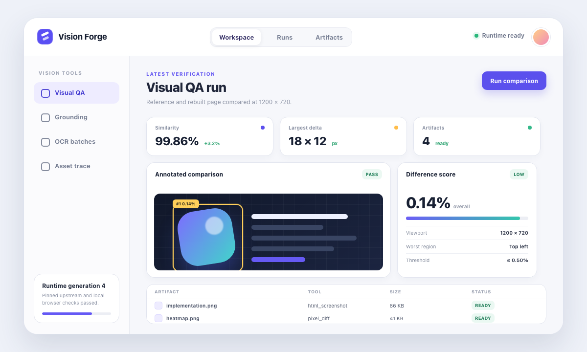

# UI 还原示例

[English](README.md) | 中文

本示例以确定性、无真实 Key 的方式证明 DSH Vision Toolkit 可以通过真实运行时闭环完成本地 UI 还原。它先用 `vision_html_screenshot` 渲染参考页面、故意不准确的初版实现和最终实现，再用 `vision_pixel_diff` 评估两个候选结果，并执行数值验收阈值。

## 流程

1. 将 `tests/fixtures/ui-restoration-reference.html` 复制到临时工作区，作为参考源文件。
2. 将 `initial.html` 和 `implementation.html` 复制到同一工作区。
3. 运行时通过固定 Chrome 系适配器，以 `1200 × 720`、缩放 `1` 渲染 3 个本地文件。
4. 运行时使用 `8 × 8` 网格和 6 个排序区域，将初版和最终截图分别与参考图比较。
5. Check 模式验证已提交证据；write 模式只在初版和最终阈值都通过后替换证据。

Runner 使用本包的 `VisionToolkitRuntime` 和 `UpstreamAdapter`，不会另行实现截图或图片差异算法。它需要带 Pillow、NumPy 的 Python，以及 Chrome、Chromium 或 Edge；不需要视觉服务 Credential。

## 输入与证据

| 路径 | 作用 |
|---|---|
| `initial.html` | 故意不准确的还原结果，用于证明比较流程能检测有意义的偏差 |
| `implementation.html` | 预期与参考页面匹配的最终还原结果 |
| `assets/reference.png` | 浏览器渲染的参考图 |
| `assets/initial.png` | 浏览器渲染的初版结果 |
| `assets/initial-heatmap.png` | 初版结果的像素差异热力图 |
| `assets/initial-report.json` | 使用相对图片路径的可移植初版比较报告 |
| `assets/implementation.png` | 浏览器渲染的最终结果 |
| `assets/final-heatmap.png` | 最终结果的像素差异热力图 |
| `assets/final-report.json` | 使用相对图片路径的可移植最终比较报告 |
| `assets/metrics.json` | Check 模式使用的稳定视口和验收指标 |




## 运行

在 `dsh-vision-toolkit/` 中执行：

```sh
npm run example:ui-restoration
```

该命令会输出结构化结果；环境、已提交资源或阈值不符合契约时以非零状态退出。已提交指标如下：

```json
{
  "initialDifferencePct": 6.04,
  "finalDifferencePct": 0,
  "initialWorstRegions": 6,
  "finalWorstRegions": 0
}
```

初版差异必须保持在 `1%` 以上，避免两个等价 fixture 让示例失去检测意义。最终差异必须不高于 `0.02%`；当前已提交证据记录精确的 `0%` 差异。

## 刷新证据

只有有意修改参考页面、还原页面、视口、渲染器契约或预期产物时，才运行 write 模式：

```sh
npm run example:ui-restoration:write
npm run example:ui-restoration
```

Write 模式会在临时工作区中渲染，验证阈值，把通过验收的 PNG 和报告复制到 `assets/`，将报告路径改写为可移植相对路径，并更新 `metrics.json`。随后必须执行 check 模式，确认已提交软件包可以复现刷新后的证据。

自动回归测试位于 `tests/ui-restoration-example.spec.ts`；macOS Chrome 钥匙串/Profile 隔离契约由 `tests/html-screenshot-guard.spec.ts` 独立覆盖。
